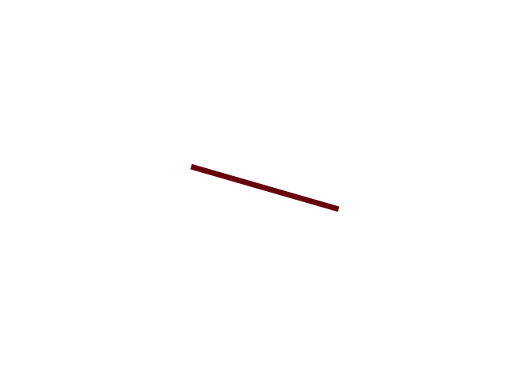
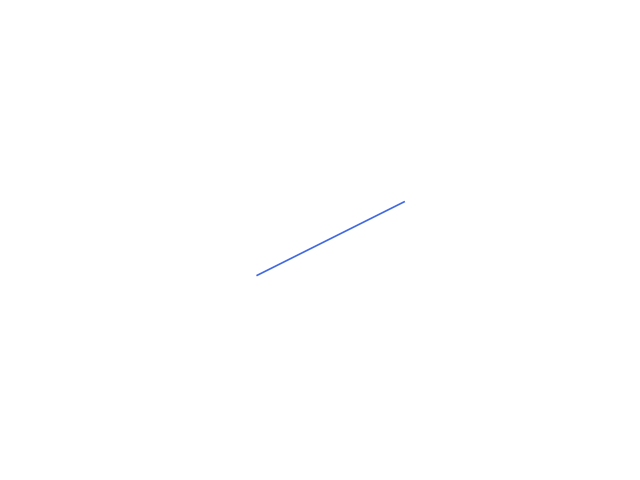

# Lindenmayer system

## Slovník
- Axiom
  - init stav 
- Rules
  - Pravidla, které definují čím jsou jednotlivé znaky nahrazeny
- Iterace
  - Kolikrát se pravidla použijí na axiom
- Angle
  - Definice natožení želvy, směr určuje +/-
- Length
  - Délka kroku

## Kroky vykreslení
- F: krok dopředu
- '+' : otočení doprava o *angle* stupňů
- '-' : otočení doleva o *angle* stupňů
- [ : uloží aktuální polohu
- ] : vrátí se na uloženou polohu

## Hilbert curve

```python
hilbert_rules = {
  "A": "-BF+AFA+FB-",
  "B": "+AF-BFB-FA+"
}
hilbert_axiom = "A"

lsystem(
  axiom=hilbert_axiom,
  rules=hilbert_rules,
  iterations=5,
  angle=90,
  length=5,
  output_file="results/hilbert_curve.gif"
)
```
```
Iteration 1: -BF+AFA+FB-
Iteration 2: -+AF-BFB-FA+F+-BF+AFA+FB-F-BF+AFA+FB-+F+AF-BFB-FA+-
Iteration 3: -+-BF+AFA+FB-F-+AF-BFB-FA+F+AF-BFB-FA+-F-BF+AFA+FB-+F+-+AF-BFB-FA+F+-BF+AFA+FB-F-BF+AFA+FB-+F+AF-BFB-FA+-F-+AF-BFB-FA+F+-BF+AFA+FB-F-BF+AFA+FB-+F+AF-BFB-FA+-+F+-BF+AFA+FB-F-+AF-BFB-FA+F+AF-BFB-FA+-F-BF+AFA+FB-+-
Iteration 4: -+-+AF-BFB-FA+F+-BF+AFA+FB-F-BF+AFA+FB-+F+AF-BFB-FA+-F-+-BF+AFA+FB-F-+AF-BFB-FA+F+AF-BFB-FA+-F-BF+AFA+FB-+F+-BF+AFA+FB-F-+AF-BFB-FA+F+AF-BFB-FA+-F-BF+AFA+FB-+-F-+AF-BFB-FA+F+-BF+AFA+FB-F-BF+AFA+FB-+F+AF-BFB-FA+-+F+-+-BF+AFA+FB-F-+AF-BFB-FA+F+AF-BFB-FA+-F-BF+AFA+FB-+F+-+AF-BFB-FA+F+-BF+AFA+FB-F-BF+AFA+FB-+F+AF-BFB-FA+-F-+AF-BFB-FA+F+-BF+AFA+FB-F-BF+AFA+FB-+F+AF-BFB-FA+-+F+-BF+AFA+FB-F-+AF-BFB-FA+F+AF-BFB-FA+-F-BF+AFA+FB-+-F-+-BF+AFA+FB-F-+AF-BFB-FA+F+AF-BFB-FA+-F-BF+AFA+FB-+F+-+AF-BFB-FA+F+-BF+AFA+FB-F-BF+AFA+FB-+F+AF-BFB-FA+-F-+AF-BFB-FA+F+-BF+AFA+FB-F-BF+AFA+FB-+F+AF-BFB-FA+-+F+-BF+AFA+FB-F-+AF-BFB-FA+F+AF-BFB-FA+-F-BF+AFA+FB-+-+F+-+AF-BFB-FA+F+-BF+AFA+FB-F-BF+AFA+FB-+F+AF-BFB-FA+-F-+-BF+AFA+FB-F-+AF-BFB-FA+F+AF-BFB-FA+-F-BF+AFA+FB-+F+-BF+AFA+FB-F-+AF-BFB-FA+F+AF-BFB-FA+-F-BF+AFA+FB-+-F-+AF-BFB-FA+F+-BF+AFA+FB-F-BF+AFA+FB-+F+AF-BFB-FA+-+-
Iteration 5: -+-+-BF+AFA+FB-F-+AF-BFB-FA+F+AF-BFB-FA+-F-BF+AFA+FB-+F+-+AF-BFB-FA+F+-BF+AFA+FB-F-BF+AFA+FB-+F+AF-BFB-FA+-F-+AF-BFB-FA+F+-BF+AFA+FB-F-BF+AFA+FB-+F+AF-BFB-FA+-+F+-BF+AFA+FB-F-+AF-BFB-FA+F+AF-BFB-FA+-F-BF+AFA+FB-+-F-+-+AF-BFB-FA+F+-BF+AFA+FB-F-BF+AFA+FB-+F+AF-BFB-FA+-F-+-BF+AFA+FB-F-+AF-BFB-FA+F+AF-BFB-FA+-F-BF+AFA+FB-+F+-BF+AFA+FB-F-+AF-BFB-FA+F+AF-BFB-FA+-F-BF+AFA+FB-+-F-+AF-BFB-FA+F+-BF+AFA+FB-F-BF+AFA+FB-+F+AF-BFB-FA+-+F+-+AF-BFB-FA+F+-BF+AFA+FB-F-BF+AFA+FB-+F+AF-BFB-FA+-F-+-BF+AFA+FB-F-+AF-BFB-FA+F+AF-BFB-FA+-F-BF+AFA+FB-+F+-BF+AFA+FB-F-+AF-BFB-FA+F+AF-BFB-FA+-F-BF+AFA+FB-+-F-+AF-BFB-FA+F+-BF+AFA+FB-F-BF+AFA+FB-+F+AF-BFB-FA+-+-F-+-BF+AFA+FB-F-+AF-BFB-FA+F+AF-BFB-FA+-F-BF+AFA+FB-+F+-+AF-BFB-FA+F+-BF+AFA+FB-F-BF+AFA+FB-+F+AF-BFB-FA+-F-+AF-BFB-FA+F+-BF+AFA+FB-F-BF+AFA+FB-+F+AF-BFB-FA+-+F+-BF+AFA+FB-F-+AF-BFB-FA+F+AF-BFB-FA+-F-BF+AFA+FB-+-+F+-+-+AF-BFB-FA+F+-BF+AFA+FB-F-BF+AFA+FB-+F+AF-BFB-FA+-F-+-BF+AFA+FB-F-+AF-BFB-FA+F+AF-BFB-FA+-F-BF+AFA+FB-+F+-BF+AFA+FB-F-+AF-BFB-FA+F+AF-BFB-FA+-F-BF+AFA+FB-+-F-+AF-BFB-FA+F+-BF+AFA+FB-F-BF+AFA+FB-+F+AF-BFB-FA+-+F+-+-BF+AFA+FB-F-+AF-BFB-FA+F+AF-BFB-FA+-F-BF+AFA+FB-+F+-+AF-BFB-FA+F+-BF+AFA+FB-F-BF+AFA+FB-+F+AF-BFB-FA+-F-+AF-BFB-FA+F+-BF+AFA+FB-F-BF+AFA+FB-+F+AF-BFB-FA+-+F+-BF+AFA+FB-F-+AF-BFB-FA+F+AF-BFB-FA+-F-BF+AFA+FB-+-F-+-BF+AFA+FB-F-+AF-BFB-FA+F+AF-BFB-FA+-F-BF+AFA+FB-+F+-+AF-BFB-FA+F+-BF+AFA+FB-F-BF+AFA+FB-+F+AF-BFB-FA+-F-+AF-BFB-FA+F+-BF+AFA+FB-F-BF+AFA+FB-+F+AF-BFB-FA+-+F+-BF+AFA+FB-F-+AF-BFB-FA+F+AF-BFB-FA+-F-BF+AFA+FB-+-+F+-+AF-BFB-FA+F+-BF+AFA+FB-F-BF+AFA+FB-+F+AF-BFB-FA+-F-+-BF+AFA+FB-F-+AF-BFB-FA+F+AF-BFB-FA+-F-BF+AFA+FB-+F+-BF+AFA+FB-F-+AF-BFB-FA+F+AF-BFB-FA+-F-BF+AFA+FB-+-F-+AF-BFB-FA+F+-BF+AFA+FB-F-BF+AFA+FB-+F+AF-BFB-FA+-+-F-+-+AF-BFB-FA+F+-BF+AFA+FB-F-BF+AFA+FB-+F+AF-BFB-FA+-F-+-BF+AFA+FB-F-+AF-BFB-FA+F+AF-BFB-FA+-F-BF+AFA+FB-+F+-BF+AFA+FB-F-+AF-BFB-FA+F+AF-BFB-FA+-F-BF+AFA+FB-+-F-+AF-BFB-FA+F+-BF+AFA+FB-F-BF+AFA+FB-+F+AF-BFB-FA+-+F+-+-BF+AFA+FB-F-+AF-BFB-FA+F+AF-BFB-FA+-F-BF+AFA+FB-+F+-+AF-BFB-FA+F+-BF+AFA+FB-F-BF+AFA+FB-+F+AF-BFB-FA+-F-+AF-BFB-FA+F+-BF+AFA+FB-F-BF+AFA+FB-+F+AF-BFB-FA+-+F+-BF+AFA+FB-F-+AF-BFB-FA+F+AF-BFB-FA+-F-BF+AFA+FB-+-F-+-BF+AFA+FB-F-+AF-BFB-FA+F+AF-BFB-FA+-F-BF+AFA+FB-+F+-+AF-BFB-FA+F+-BF+AFA+FB-F-BF+AFA+FB-+F+AF-BFB-FA+-F-+AF-BFB-FA+F+-BF+AFA+FB-F-BF+AFA+FB-+F+AF-BFB-FA+-+F+-BF+AFA+FB-F-+AF-BFB-FA+F+AF-BFB-FA+-F-BF+AFA+FB-+-+F+-+AF-BFB-FA+F+-BF+AFA+FB-F-BF+AFA+FB-+F+AF-BFB-FA+-F-+-BF+AFA+FB-F-+AF-BFB-FA+F+AF-BFB-FA+-F-BF+AFA+FB-+F+-BF+AFA+FB-F-+AF-BFB-FA+F+AF-BFB-FA+-F-BF+AFA+FB-+-F-+AF-BFB-FA+F+-BF+AFA+FB-F-BF+AFA+FB-+F+AF-BFB-FA+-+-+F+-+-BF+AFA+FB-F-+AF-BFB-FA+F+AF-BFB-FA+-F-BF+AFA+FB-+F+-+AF-BFB-FA+F+-BF+AFA+FB-F-BF+AFA+FB-+F+AF-BFB-FA+-F-+AF-BFB-FA+F+-BF+AFA+FB-F-BF+AFA+FB-+F+AF-BFB-FA+-+F+-BF+AFA+FB-F-+AF-BFB-FA+F+AF-BFB-FA+-F-BF+AFA+FB-+-F-+-+AF-BFB-FA+F+-BF+AFA+FB-F-BF+AFA+FB-+F+AF-BFB-FA+-F-+-BF+AFA+FB-F-+AF-BFB-FA+F+AF-BFB-FA+-F-BF+AFA+FB-+F+-BF+AFA+FB-F-+AF-BFB-FA+F+AF-BFB-FA+-F-BF+AFA+FB-+-F-+AF-BFB-FA+F+-BF+AFA+FB-F-BF+AFA+FB-+F+AF-BFB-FA+-+F+-+AF-BFB-FA+F+-BF+AFA+FB-F-BF+AFA+FB-+F+AF-BFB-FA+-F-+-BF+AFA+FB-F-+AF-BFB-FA+F+AF-BFB-FA+-F-BF+AFA+FB-+F+-BF+AFA+FB-F-+AF-BFB-FA+F+AF-BFB-FA+-F-BF+AFA+FB-+-F-+AF-BFB-FA+F+-BF+AFA+FB-F-BF+AFA+FB-+F+AF-BFB-FA+-+-F-+-BF+AFA+FB-F-+AF-BFB-FA+F+AF-BFB-FA+-F-BF+AFA+FB-+F+-+AF-BFB-FA+F+-BF+AFA+FB-F-BF+AFA+FB-+F+AF-BFB-FA+-F-+AF-BFB-FA+F+-BF+AFA+FB-F-BF+AFA+FB-+F+AF-BFB-FA+-+F+-BF+AFA+FB-F-+AF-BFB-FA+F+AF-BFB-FA+-F-BF+AFA+FB-+-+-
```


## Dragon curve

```python
dragon_rules = {
  "X": "X+YF+",
  "Y": "-FX-Y"
}
dragon_axiom = "FX"
iterations = 10
angle = 90
length = 5

lsystem(
  axiom=dragon_axiom,
  rules=dragon_rules,
  iterations=iterations,
  angle=angle,
  length=length,
  output_file="results/dragon_curve.gif")
```
```
Iteration 1: FX+YF+
Iteration 2: FX+YF++-FX-YF+
Iteration 3: FX+YF++-FX-YF++-FX+YF+--FX-YF+
Iteration 4: FX+YF++-FX-YF++-FX+YF+--FX-YF++-FX+YF++-FX-YF+--FX+YF+--FX-YF+
Iteration 5: FX+YF++-FX-YF++-FX+YF+--FX-YF++-FX+YF++-FX-YF+--FX+YF+--FX-YF++-FX+YF++-FX-YF++-FX+YF+--FX-YF+--FX+YF++-FX-YF+--FX+YF+--FX-YF+
Iteration 6: FX+YF++-FX-YF++-FX+YF+--FX-YF++-FX+YF++-FX-YF+--FX+YF+--FX-YF++-FX+YF++-FX-YF++-FX+YF+--FX-YF+--FX+YF++-FX-YF+--FX+YF+--FX-YF++-FX+YF++-FX-YF++-FX+YF+--FX-YF++-FX+YF++-FX-YF+--FX+YF+--FX-YF+--FX+YF++-FX-YF++-FX+YF+--FX-YF+--FX+YF++-FX-YF+--FX+YF+--FX-YF+
Iteration 7: FX+YF++-FX-YF++-FX+YF+--FX-YF++-FX+YF++-FX-YF+--FX+YF+--FX-YF++-FX+YF++-FX-YF++-FX+YF+--FX-YF+--FX+YF++-FX-YF+--FX+YF+--FX-YF++-FX+YF++-FX-YF++-FX+YF+--FX-YF++-FX+YF++-FX-YF+--FX+YF+--FX-YF+--FX+YF++-FX-YF++-FX+YF+--FX-YF+--FX+YF++-FX-YF+--FX+YF+--FX-YF++-FX+YF++-FX-YF++-FX+YF+--FX-YF++-FX+YF++-FX-YF+--FX+YF+--FX-YF++-FX+YF++-FX-YF++-FX+YF+--FX-YF+--FX+YF++-FX-YF+--FX+YF+--FX-YF+--FX+YF++-FX-YF++-FX+YF+--FX-YF++-FX+YF++-FX-YF+--FX+YF+--FX-YF+--FX+YF++-FX-YF++-FX+YF+--FX-YF+--FX+YF++-FX-YF+--FX+YF+--FX-YF+
Iteration 8: FX+YF++-FX-YF++-FX+YF+--FX-YF++-FX+YF++-FX-YF+--FX+YF+--FX-YF++-FX+YF++-FX-YF++-FX+YF+--FX-YF+--FX+YF++-FX-YF+--FX+YF+--FX-YF++-FX+YF++-FX-YF++-FX+YF+--FX-YF++-FX+YF++-FX-YF+--FX+YF+--FX-YF+--FX+YF++-FX-YF++-FX+YF+--FX-YF+--FX+YF++-FX-YF+--FX+YF+--FX-YF++-FX+YF++-FX-YF++-FX+YF+--FX-YF++-FX+YF++-FX-YF+--FX+YF+--FX-YF++-FX+YF++-FX-YF++-FX+YF+--FX-YF+--FX+YF++-FX-YF+--FX+YF+--FX-YF+--FX+YF++-FX-YF++-FX+YF+--FX-YF++-FX+YF++-FX-YF+--FX+YF+--FX-YF+--FX+YF++-FX-YF++-FX+YF+--FX-YF+--FX+YF++-FX-YF+--FX+YF+--FX-YF++-FX+YF++-FX-YF++-FX+YF+--FX-YF++-FX+YF++-FX-YF+--FX+YF+--FX-YF++-FX+YF++-FX-YF++-FX+YF+--FX-YF+--FX+YF++-FX-YF+--FX+YF+--FX-YF++-FX+YF++-FX-YF++-FX+YF+--FX-YF++-FX+YF++-FX-YF+--FX+YF+--FX-YF+--FX+YF++-FX-YF++-FX+YF+--FX-YF+--FX+YF++-FX-YF+--FX+YF+--FX-YF+--FX+YF++-FX-YF++-FX+YF+--FX-YF++-FX+YF++-FX-YF+--FX+YF+--FX-YF++-FX+YF++-FX-YF++-FX+YF+--FX-YF+--FX+YF++-FX-YF+--FX+YF+--FX-YF+--FX+YF++-FX-YF++-FX+YF+--FX-YF++-FX+YF++-FX-YF+--FX+YF+--FX-YF+--FX+YF++-FX-YF++-FX+YF+--FX-YF+--FX+YF++-FX-YF+--FX+YF+--FX-YF+
Iteration 9: FX+YF++-FX-YF++-FX+YF+--FX-YF++-FX+YF++-FX-YF+--FX+YF+--FX-YF++-FX+YF++-FX-YF++-FX+YF+--FX-YF+--FX+YF++-FX-YF+--FX+YF+--FX-YF++-FX+YF++-FX-YF++-FX+YF+--FX-YF++-FX+YF++-FX-YF+--FX+YF+--FX-YF+--FX+YF++-FX-YF++-FX+YF+--FX-YF+--FX+YF++-FX-YF+--FX+YF+--FX-YF++-FX+YF++-FX-YF++-FX+YF+--FX-YF++-FX+YF++-FX-YF+--FX+YF+--FX-YF++-FX+YF++-FX-YF++-FX+YF+--FX-YF+--FX+YF++-FX-YF+--FX+YF+--FX-YF+--FX+YF++-FX-YF++-FX+YF+--FX-YF++-FX+YF++-FX-YF+--FX+YF+--FX-YF+--FX+YF++-FX-YF++-FX+YF+--FX-YF+--FX+YF++-FX-YF+--FX+YF+--FX-YF++-FX+YF++-FX-YF++-FX+YF+--FX-YF++-FX+YF++-FX-YF+--FX+YF+--FX-YF++-FX+YF++-FX-YF++-FX+YF+--FX-YF+--FX+YF++-FX-YF+--FX+YF+--FX-YF++-FX+YF++-FX-YF++-FX+YF+--FX-YF++-FX+YF++-FX-YF+--FX+YF+--FX-YF+--FX+YF++-FX-YF++-FX+YF+--FX-YF+--FX+YF++-FX-YF+--FX+YF+--FX-YF+--FX+YF++-FX-YF++-FX+YF+--FX-YF++-FX+YF++-FX-YF+--FX+YF+--FX-YF++-FX+YF++-FX-YF++-FX+YF+--FX-YF+--FX+YF++-FX-YF+--FX+YF+--FX-YF+--FX+YF++-FX-YF++-FX+YF+--FX-YF++-FX+YF++-FX-YF+--FX+YF+--FX-YF+--FX+YF++-FX-YF++-FX+YF+--FX-YF+--FX+YF++-FX-YF+--FX+YF+--FX-YF++-FX+YF++-FX-YF++-FX+YF+--FX-YF++-FX+YF++-FX-YF+--FX+YF+--FX-YF++-FX+YF++-FX-YF++-FX+YF+--FX-YF+--FX+YF++-FX-YF+--FX+YF+--FX-YF++-FX+YF++-FX-YF++-FX+YF+--FX-YF++-FX+YF++-FX-YF+--FX+YF+--FX-YF+--FX+YF++-FX-YF++-FX+YF+--FX-YF+--FX+YF++-FX-YF+--FX+YF+--FX-YF++-FX+YF++-FX-YF++-FX+YF+--FX-YF++-FX+YF++-FX-YF+--FX+YF+--FX-YF++-FX+YF++-FX-YF++-FX+YF+--FX-YF+--FX+YF++-FX-YF+--FX+YF+--FX-YF+--FX+YF++-FX-YF++-FX+YF+--FX-YF++-FX+YF++-FX-YF+--FX+YF+--FX-YF+--FX+YF++-FX-YF++-FX+YF+--FX-YF+--FX+YF++-FX-YF+--FX+YF+--FX-YF+--FX+YF++-FX-YF++-FX+YF+--FX-YF++-FX+YF++-FX-YF+--FX+YF+--FX-YF++-FX+YF++-FX-YF++-FX+YF+--FX-YF+--FX+YF++-FX-YF+--FX+YF+--FX-YF++-FX+YF++-FX-YF++-FX+YF+--FX-YF++-FX+YF++-FX-YF+--FX+YF+--FX-YF+--FX+YF++-FX-YF++-FX+YF+--FX-YF+--FX+YF++-FX-YF+--FX+YF+--FX-YF+--FX+YF++-FX-YF++-FX+YF+--FX-YF++-FX+YF++-FX-YF+--FX+YF+--FX-YF++-FX+YF++-FX-YF++-FX+YF+--FX-YF+--FX+YF++-FX-YF+--FX+YF+--FX-YF+--FX+YF++-FX-YF++-FX+YF+--FX-YF++-FX+YF++-FX-YF+--FX+YF+--FX-YF+--FX+YF++-FX-YF++-FX+YF+--FX-YF+--FX+YF++-FX-YF+--FX+YF+--FX-YF+
Iteration 10: FX+YF++-FX-YF++-FX+YF+--FX-YF++-FX+YF++-FX-YF+--FX+YF+--FX-YF++-FX+YF++-FX-YF++-FX+YF+--FX-YF+--FX+YF++-FX-YF+--FX+YF+--FX-YF++-FX+YF++-FX-YF++-FX+YF+--FX-YF++-FX+YF++-FX-YF+--FX+YF+--FX-YF+--FX+YF++-FX-YF++-FX+YF+--FX-YF+--FX+YF++-FX-YF+--FX+YF+--FX-YF++-FX+YF++-FX-YF++-FX+YF+--FX-YF++-FX+YF++-FX-YF+--FX+YF+--FX-YF++-FX+YF++-FX-YF++-FX+YF+--FX-YF+--FX+YF++-FX-YF+--FX+YF+--FX-YF+--FX+YF++-FX-YF++-FX+YF+--FX-YF++-FX+YF++-FX-YF+--FX+YF+--FX-YF+--FX+YF++-FX-YF++-FX+YF+--FX-YF+--FX+YF++-FX-YF+--FX+YF+--FX-YF++-FX+YF++-FX-YF++-FX+YF+--FX-YF++-FX+YF++-FX-YF+--FX+YF+--FX-YF++-FX+YF++-FX-YF++-FX+YF+--FX-YF+--FX+YF++-FX-YF+--FX+YF+--FX-YF++-FX+YF++-FX-YF++-FX+YF+--FX-YF++-FX+YF++-FX-YF+--FX+YF+--FX-YF+--FX+YF++-FX-YF++-FX+YF+--FX-YF+--FX+YF++-FX-YF+--FX+YF+--FX-YF+--FX+YF++-FX-YF++-FX+YF+--FX-YF++-FX+YF++-FX-YF+--FX+YF+--FX-YF++-FX+YF++-FX-YF++-FX+YF+--FX-YF+--FX+YF++-FX-YF+--FX+YF+--FX-YF+--FX+YF++-FX-YF++-FX+YF+--FX-YF++-FX+YF++-FX-YF+--FX+YF+--FX-YF+--FX+YF++-FX-YF++-FX+YF+--FX-YF+--FX+YF++-FX-YF+--FX+YF+--FX-YF++-FX+YF++-FX-YF++-FX+YF+--FX-YF++-FX+YF++-FX-YF+--FX+YF+--FX-YF++-FX+YF++-FX-YF++-FX+YF+--FX-YF+--FX+YF++-FX-YF+--FX+YF+--FX-YF++-FX+YF++-FX-YF++-FX+YF+--FX-YF++-FX+YF++-FX-YF+--FX+YF+--FX-YF+--FX+YF++-FX-YF++-FX+YF+--FX-YF+--FX+YF++-FX-YF+--FX+YF+--FX-YF++-FX+YF++-FX-YF++-FX+YF+--FX-YF++-FX+YF++-FX-YF+--FX+YF+--FX-YF++-FX+YF++-FX-YF++-FX+YF+--FX-YF+--FX+YF++-FX-YF+--FX+YF+--FX-YF+--FX+YF++-FX-YF++-FX+YF+--FX-YF++-FX+YF++-FX-YF+--FX+YF+--FX-YF+--FX+YF++-FX-YF++-FX+YF+--FX-YF+--FX+YF++-FX-YF+--FX+YF+--FX-YF+--FX+YF++-FX-YF++-FX+YF+--FX-YF++-FX+YF++-FX-YF+--FX+YF+--FX-YF++-FX+YF++-FX-YF++-FX+YF+--FX-YF+--FX+YF++-FX-YF+--FX+YF+--FX-YF++-FX+YF++-FX-YF++-FX+YF+--FX-YF++-FX+YF++-FX-YF+--FX+YF+--FX-YF+--FX+YF++-FX-YF++-FX+YF+--FX-YF+--FX+YF++-FX-YF+--FX+YF+--FX-YF+--FX+YF++-FX-YF++-FX+YF+--FX-YF++-FX+YF++-FX-YF+--FX+YF+--FX-YF++-FX+YF++-FX-YF++-FX+YF+--FX-YF+--FX+YF++-FX-YF+--FX+YF+--FX-YF+--FX+YF++-FX-YF++-FX+YF+--FX-YF++-FX+YF++-FX-YF+--FX+YF+--FX-YF+--FX+YF++-FX-YF++-FX+YF+--FX-YF+--FX+YF++-FX-YF+--FX+YF+--FX-YF++-FX+YF++-FX-YF++-FX+YF+--FX-YF++-FX+YF++-FX-YF+--FX+YF+--FX-YF++-FX+YF++-FX-YF++-FX+YF+--FX-YF+--FX+YF++-FX-YF+--FX+YF+--FX-YF++-FX+YF++-FX-YF++-FX+YF+--FX-YF++-FX+YF++-FX-YF+--FX+YF+--FX-YF+--FX+YF++-FX-YF++-FX+YF+--FX-YF+--FX+YF++-FX-YF+--FX+YF+--FX-YF++-FX+YF++-FX-YF++-FX+YF+--FX-YF++-FX+YF++-FX-YF+--FX+YF+--FX-YF++-FX+YF++-FX-YF++-FX+YF+--FX-YF+--FX+YF++-FX-YF+--FX+YF+--FX-YF+--FX+YF++-FX-YF++-FX+YF+--FX-YF++-FX+YF++-FX-YF+--FX+YF+--FX-YF+--FX+YF++-FX-YF++-FX+YF+--FX-YF+--FX+YF++-FX-YF+--FX+YF+--FX-YF++-FX+YF++-FX-YF++-FX+YF+--FX-YF++-FX+YF++-FX-YF+--FX+YF+--FX-YF++-FX+YF++-FX-YF++-FX+YF+--FX-YF+--FX+YF++-FX-YF+--FX+YF+--FX-YF++-FX+YF++-FX-YF++-FX+YF+--FX-YF++-FX+YF++-FX-YF+--FX+YF+--FX-YF+--FX+YF++-FX-YF++-FX+YF+--FX-YF+--FX+YF++-FX-YF+--FX+YF+--FX-YF+--FX+YF++-FX-YF++-FX+YF+--FX-YF++-FX+YF++-FX-YF+--FX+YF+--FX-YF++-FX+YF++-FX-YF++-FX+YF+--FX-YF+--FX+YF++-FX-YF+--FX+YF+--FX-YF+--FX+YF++-FX-YF++-FX+YF+--FX-YF++-FX+YF++-FX-YF+--FX+YF+--FX-YF+--FX+YF++-FX-YF++-FX+YF+--FX-YF+--FX+YF++-FX-YF+--FX+YF+--FX-YF+--FX+YF++-FX-YF++-FX+YF+--FX-YF++-FX+YF++-FX-YF+--FX+YF+--FX-YF++-FX+YF++-FX-YF++-FX+YF+--FX-YF+--FX+YF++-FX-YF+--FX+YF+--FX-YF++-FX+YF++-FX-YF++-FX+YF+--FX-YF++-FX+YF++-FX-YF+--FX+YF+--FX-YF+--FX+YF++-FX-YF++-FX+YF+--FX-YF+--FX+YF++-FX-YF+--FX+YF+--FX-YF++-FX+YF++-FX-YF++-FX+YF+--FX-YF++-FX+YF++-FX-YF+--FX+YF+--FX-YF++-FX+YF++-FX-YF++-FX+YF+--FX-YF+--FX+YF++-FX-YF+--FX+YF+--FX-YF+--FX+YF++-FX-YF++-FX+YF+--FX-YF++-FX+YF++-FX-YF+--FX+YF+--FX-YF+--FX+YF++-FX-YF++-FX+YF+--FX-YF+--FX+YF++-FX-YF+--FX+YF+--FX-YF+--FX+YF++-FX-YF++-FX+YF+--FX-YF++-FX+YF++-FX-YF+--FX+YF+--FX-YF++-FX+YF++-FX-YF++-FX+YF+--FX-YF+--FX+YF++-FX-YF+--FX+YF+--FX-YF++-FX+YF++-FX-YF++-FX+YF+--FX-YF++-FX+YF++-FX-YF+--FX+YF+--FX-YF+--FX+YF++-FX-YF++-FX+YF+--FX-YF+--FX+YF++-FX-YF+--FX+YF+--FX-YF+--FX+YF++-FX-YF++-FX+YF+--FX-YF++-FX+YF++-FX-YF+--FX+YF+--FX-YF++-FX+YF++-FX-YF++-FX+YF+--FX-YF+--FX+YF++-FX-YF+--FX+YF+--FX-YF+--FX+YF++-FX-YF++-FX+YF+--FX-YF++-FX+YF++-FX-YF+--FX+YF+--FX-YF+--FX+YF++-FX-YF++-FX+YF+--FX-YF+--FX+YF++-FX-YF+--FX+YF+--FX-YF+
```


## Fractal plant

```python
plant_rules = {
  "X": "F-[[X]+X]+F[+FX]-X",
  "F": "FF"
}
plant_axiom = "X"

lsystem(
  axiom=plant_axiom,
  rules=plant_rules,
  iterations=6,
  angle=25,
  length=5,
  output_file="results/fractal_plant.gif"
)
```
```
Iteration 1: F-[[X]+X]+F[+FX]-X
Iteration 2: FF-[[F-[[X]+X]+F[+FX]-X]+F-[[X]+X]+F[+FX]-X]+FF[+FFF-[[X]+X]+F[+FX]-X]-F-[[X]+X]+F[+FX]-X
Iteration 3: FFFF-[[FF-[[F-[[X]+X]+F[+FX]-X]+F-[[X]+X]+F[+FX]-X]+FF[+FFF-[[X]+X]+F[+FX]-X]-F-[[X]+X]+F[+FX]-X]+FF-[[F-[[X]+X]+F[+FX]-X]+F-[[X]+X]+F[+FX]-X]+FF[+FFF-[[X]+X]+F[+FX]-X]-F-[[X]+X]+F[+FX]-X]+FFFF[+FFFFFF-[[F-[[X]+X]+F[+FX]-X]+F-[[X]+X]+F[+FX]-X]+FF[+FFF-[[X]+X]+F[+FX]-X]-F-[[X]+X]+F[+FX]-X]-FF-[[F-[[X]+X]+F[+FX]-X]+F-[[X]+X]+F[+FX]-X]+FF[+FFF-[[X]+X]+F[+FX]-X]-F-[[X]+X]+F[+FX]-X
Iteration 4: FFFFFFFF-[[FFFF-[[FF-[[F-[[X]+X]+F[+FX]-X]+F-[[X]+X]+F[+FX]-X]+FF[+FFF-[[X]+X]+F[+FX]-X]-F-[[X]+X]+F[+FX]-X]+FF-[[F-[[X]+X]+F[+FX]-X]+F-[[X]+X]+F[+FX]-X]+FF[+FFF-[[X]+X]+F[+FX]-X]-F-[[X]+X]+F[+FX]-X]+FFFF[+FFFFFF-[[F-[[X]+X]+F[+FX]-X]+F-[[X]+X]+F[+FX]-X]+FF[+FFF-[[X]+X]+F[+FX]-X]-F-[[X]+X]+F[+FX]-X]-FF-[[F-[[X]+X]+F[+FX]-X]+F-[[X]+X]+F[+FX]-X]+FF[+FFF-[[X]+X]+F[+FX]-X]-F-[[X]+X]+F[+FX]-X]+FFFF-[[FF-[[F-[[X]+X]+F[+FX]-X]+F-[[X]+X]+F[+FX]-X]+FF[+FFF-[[X]+X]+F[+FX]-X]-F-[[X]+X]+F[+FX]-X]+FF-[[F-[[X]+X]+F[+FX]-X]+F-[[X]+X]+F[+FX]-X]+FF[+FFF-[[X]+X]+F[+FX]-X]-F-[[X]+X]+F[+FX]-X]+FFFF[+FFFFFF-[[F-[[X]+X]+F[+FX]-X]+F-[[X]+X]+F[+FX]-X]+FF[+FFF-[[X]+X]+F[+FX]-X]-F-[[X]+X]+F[+FX]-X]-FF-[[F-[[X]+X]+F[+FX]-X]+F-[[X]+X]+F[+FX]-X]+FF[+FFF-[[X]+X]+F[+FX]-X]-F-[[X]+X]+F[+FX]-X]+FFFFFFFF[+FFFFFFFFFFFF-[[FF-[[F-[[X]+X]+F[+FX]-X]+F-[[X]+X]+F[+FX]-X]+FF[+FFF-[[X]+X]+F[+FX]-X]-F-[[X]+X]+F[+FX]-X]+FF-[[F-[[X]+X]+F[+FX]-X]+F-[[X]+X]+F[+FX]-X]+FF[+FFF-[[X]+X]+F[+FX]-X]-F-[[X]+X]+F[+FX]-X]+FFFF[+FFFFFF-[[F-[[X]+X]+F[+FX]-X]+F-[[X]+X]+F[+FX]-X]+FF[+FFF-[[X]+X]+F[+FX]-X]-F-[[X]+X]+F[+FX]-X]-FF-[[F-[[X]+X]+F[+FX]-X]+F-[[X]+X]+F[+FX]-X]+FF[+FFF-[[X]+X]+F[+FX]-X]-F-[[X]+X]+F[+FX]-X]-FFFF-[[FF-[[F-[[X]+X]+F[+FX]-X]+F-[[X]+X]+F[+FX]-X]+FF[+FFF-[[X]+X]+F[+FX]-X]-F-[[X]+X]+F[+FX]-X]+FF-[[F-[[X]+X]+F[+FX]-X]+F-[[X]+X]+F[+FX]-X]+FF[+FFF-[[X]+X]+F[+FX]-X]-F-[[X]+X]+F[+FX]-X]+FFFF[+FFFFFF-[[F-[[X]+X]+F[+FX]-X]+F-[[X]+X]+F[+FX]-X]+FF[+FFF-[[X]+X]+F[+FX]-X]-F-[[X]+X]+F[+FX]-X]-FF-[[F-[[X]+X]+F[+FX]-X]+F-[[X]+X]+F[+FX]-X]+FF[+FFF-[[X]+X]+F[+FX]-X]-F-[[X]+X]+F[+FX]-X
Iteration 5: FFFFFFFFFFFFFFFF-[[FFFFFFFF-[[FFFF-[[FF-[[F-[[X]+X]+F[+FX]-X]+F-[[X]+X]+F[+FX]-X]+FF[+FFF-[[X]+X]+F[+FX]-X]-F-[[X]+X]+F[+FX]-X]+FF-[[F-[[X]+X]+F[+FX]-X]+F-[[X]+X]+F[+FX]-X]+FF[+FFF-[[X]+X]+F[+FX]-X]-F-[[X]+X]+F[+FX]-X]+FFFF[+FFFFFF-[[F-[[X]+X]+F[+FX]-X]+F-[[X]+X]+F[+FX]-X]+FF[+FFF-[[X]+X]+F[+FX]-X]-F-[[X]+X]+F[+FX]-X]-FF-[[F-[[X]+X]+F[+FX]-X]+F-[[X]+X]+F[+FX]-X]+FF[+FFF-[[X]+X]+F[+FX]-X]-F-[[X]+X]+F[+FX]-X]+FFFF-[[FF-[[F-[[X]+X]+F[+FX]-X]+F-[[X]+X]+F[+FX]-X]+FF[+FFF-[[X]+X]+F[+FX]-X]-F-[[X]+X]+F[+FX]-X]+FF-[[F-[[X]+X]+F[+FX]-X]+F-[[X]+X]+F[+FX]-X]+FF[+FFF-[[X]+X]+F[+FX]-X]-F-[[X]+X]+F[+FX]-X]+FFFF[+FFFFFF-[[F-[[X]+X]+F[+FX]-X]+F-[[X]+X]+F[+FX]-X]+FF[+FFF-[[X]+X]+F[+FX]-X]-F-[[X]+X]+F[+FX]-X]-FF-[[F-[[X]+X]+F[+FX]-X]+F-[[X]+X]+F[+FX]-X]+FF[+FFF-[[X]+X]+F[+FX]-X]-F-[[X]+X]+F[+FX]-X]+FFFFFFFF[+FFFFFFFFFFFF-[[FF-[[F-[[X]+X]+F[+FX]-X]+F-[[X]+X]+F[+FX]-X]+FF[+FFF-[[X]+X]+F[+FX]-X]-F-[[X]+X]+F[+FX]-X]+FF-[[F-[[X]+X]+F[+FX]-X]+F-[[X]+X]+F[+FX]-X]+FF[+FFF-[[X]+X]+F[+FX]-X]-F-[[X]+X]+F[+FX]-X]+FFFF[+FFFFFF-[[F-[[X]+X]+F[+FX]-X]+F-[[X]+X]+F[+FX]-X]+FF[+FFF-[[X]+X]+F[+FX]-X]-F-[[X]+X]+F[+FX]-X]-FF-[[F-[[X]+X]+F[+FX]-X]+F-[[X]+X]+F[+FX]-X]+FF[+FFF-[[X]+X]+F[+FX]-X]-F-[[X]+X]+F[+FX]-X]-FFFF-[[FF-[[F-[[X]+X]+F[+FX]-X]+F-[[X]+X]+F[+FX]-X]+FF[+FFF-[[X]+X]+F[+FX]-X]-F-[[X]+X]+F[+FX]-X]+FF-[[F-[[X]+X]+F[+FX]-X]+F-[[X]+X]+F[+FX]-X]+FF[+FFF-[[X]+X]+F[+FX]-X]-F-[[X]+X]+F[+FX]-X]+FFFF[+FFFFFF-[[F-[[X]+X]+F[+FX]-X]+F-[[X]+X]+F[+FX]-X]+FF[+FFF-[[X]+X]+F[+FX]-X]-F-[[X]+X]+F[+FX]-X]-FF-[[F-[[X]+X]+F[+FX]-X]+F-[[X]+X]+F[+FX]-X]+FF[+FFF-[[X]+X]+F[+FX]-X]-F-[[X]+X]+F[+FX]-X]+FFFFFFFF-[[FFFF-[[FF-[[F-[[X]+X]+F[+FX]-X]+F-[[X]+X]+F[+FX]-X]+FF[+FFF-[[X]+X]+F[+FX]-X]-F-[[X]+X]+F[+FX]-X]+FF-[[F-[[X]+X]+F[+FX]-X]+F-[[X]+X]+F[+FX]-X]+FF[+FFF-[[X]+X]+F[+FX]-X]-F-[[X]+X]+F[+FX]-X]+FFFF[+FFFFFF-[[F-[[X]+X]+F[+FX]-X]+F-[[X]+X]+F[+FX]-X]+FF[+FFF-[[X]+X]+F[+FX]-X]-F-[[X]+X]+F[+FX]-X]-FF-[[F-[[X]+X]+F[+FX]-X]+F-[[X]+X]+F[+FX]-X]+FF[+FFF-[[X]+X]+F[+FX]-X]-F-[[X]+X]+F[+FX]-X]+FFFF-[[FF-[[F-[[X]+X]+F[+FX]-X]+F-[[X]+X]+F[+FX]-X]+FF[+FFF-[[X]+X]+F[+FX]-X]-F-[[X]+X]+F[+FX]-X]+FF-[[F-[[X]+X]+F[+FX]-X]+F-[[X]+X]+F[+FX]-X]+FF[+FFF-[[X]+X]+F[+FX]-X]-F-[[X]+X]+F[+FX]-X]+FFFF[+FFFFFF-[[F-[[X]+X]+F[+FX]-X]+F-[[X]+X]+F[+FX]-X]+FF[+FFF-[[X]+X]+F[+FX]-X]-F-[[X]+X]+F[+FX]-X]-FF-[[F-[[X]+X]+F[+FX]-X]+F-[[X]+X]+F[+FX]-X]+FF[+FFF-[[X]+X]+F[+FX]-X]-F-[[X]+X]+F[+FX]-X]+FFFFFFFF[+FFFFFFFFFFFF-[[FF-[[F-[[X]+X]+F[+FX]-X]+F-[[X]+X]+F[+FX]-X]+FF[+FFF-[[X]+X]+F[+FX]-X]-F-[[X]+X]+F[+FX]-X]+FF-[[F-[[X]+X]+F[+FX]-X]+F-[[X]+X]+F[+FX]-X]+FF[+FFF-[[X]+X]+F[+FX]-X]-F-[[X]+X]+F[+FX]-X]+FFFF[+FFFFFF-[[F-[[X]+X]+F[+FX]-X]+F-[[X]+X]+F[+FX]-X]+FF[+FFF-[[X]+X]+F[+FX]-X]-F-[[X]+X]+F[+FX]-X]-FF-[[F-[[X]+X]+F[+FX]-X]+F-[[X]+X]+F[+FX]-X]+FF[+FFF-[[X]+X]+F[+FX]-X]-F-[[X]+X]+F[+FX]-X]-FFFF-[[FF-[[F-[[X]+X]+F[+FX]-X]+F-[[X]+X]+F[+FX]-X]+FF[+FFF-[[X]+X]+F[+FX]-X]-F-[[X]+X]+F[+FX]-X]+FF-[[F-[[X]+X]+F[+FX]-X]+F-[[X]+X]+F[+FX]-X]+FF[+FFF-[[X]+X]+F[+FX]-X]-F-[[X]+X]+F[+FX]-X]+FFFF[+FFFFFF-[[F-[[X]+X]+F[+FX]-X]+F-[[X]+X]+F[+FX]-X]+FF[+FFF-[[X]+X]+F[+FX]-X]-F-[[X]+X]+F[+FX]-X]-FF-[[F-[[X]+X]+F[+FX]-X]+F-[[X]+X]+F[+FX]-X]+FF[+FFF-[[X]+X]+F[+FX]-X]-F-[[X]+X]+F[+FX]-X]+FFFFFFFFFFFFFFFF[+FFFFFFFFFFFFFFFFFFFFFFFF-[[FFFF-[[FF-[[F-[[X]+X]+F[+FX]-X]+F-[[X]+X]+F[+FX]-X]+FF[+FFF-[[X]+X]+F[+FX]-X]-F-[[X]+X]+F[+FX]-X]+FF-[[F-[[X]+X]+F[+FX]-X]+F-[[X]+X]+F[+FX]-X]+FF[+FFF-[[X]+X]+F[+FX]-X]-F-[[X]+X]+F[+FX]-X]+FFFF[+FFFFFF-[[F-[[X]+X]+F[+FX]-X]+F-[[X]+X]+F[+FX]-X]+FF[+FFF-[[X]+X]+F[+FX]-X]-F-[[X]+X]+F[+FX]-X]-FF-[[F-[[X]+X]+F[+FX]-X]+F-[[X]+X]+F[+FX]-X]+FF[+FFF-[[X]+X]+F[+FX]-X]-F-[[X]+X]+F[+FX]-X]+FFFF-[[FF-[[F-[[X]+X]+F[+FX]-X]+F-[[X]+X]+F[+FX]-X]+FF[+FFF-[[X]+X]+F[+FX]-X]-F-[[X]+X]+F[+FX]-X]+FF-[[F-[[X]+X]+F[+FX]-X]+F-[[X]+X]+F[+FX]-X]+FF[+FFF-[[X]+X]+F[+FX]-X]-F-[[X]+X]+F[+FX]-X]+FFFF[+FFFFFF-[[F-[[X]+X]+F[+FX]-X]+F-[[X]+X]+F[+FX]-X]+FF[+FFF-[[X]+X]+F[+FX]-X]-F-[[X]+X]+F[+FX]-X]-FF-[[F-[[X]+X]+F[+FX]-X]+F-[[X]+X]+F[+FX]-X]+FF[+FFF-[[X]+X]+F[+FX]-X]-F-[[X]+X]+F[+FX]-X]+FFFFFFFF[+FFFFFFFFFFFF-[[FF-[[F-[[X]+X]+F[+FX]-X]+F-[[X]+X]+F[+FX]-X]+FF[+FFF-[[X]+X]+F[+FX]-X]-F-[[X]+X]+F[+FX]-X]+FF-[[F-[[X]+X]+F[+FX]-X]+F-[[X]+X]+F[+FX]-X]+FF[+FFF-[[X]+X]+F[+FX]-X]-F-[[X]+X]+F[+FX]-X]+FFFF[+FFFFFF-[[F-[[X]+X]+F[+FX]-X]+F-[[X]+X]+F[+FX]-X]+FF[+FFF-[[X]+X]+F[+FX]-X]-F-[[X]+X]+F[+FX]-X]-FF-[[F-[[X]+X]+F[+FX]-X]+F-[[X]+X]+F[+FX]-X]+FF[+FFF-[[X]+X]+F[+FX]-X]-F-[[X]+X]+F[+FX]-X]-FFFF-[[FF-[[F-[[X]+X]+F[+FX]-X]+F-[[X]+X]+F[+FX]-X]+FF[+FFF-[[X]+X]+F[+FX]-X]-F-[[X]+X]+F[+FX]-X]+FF-[[F-[[X]+X]+F[+FX]-X]+F-[[X]+X]+F[+FX]-X]+FF[+FFF-[[X]+X]+F[+FX]-X]-F-[[X]+X]+F[+FX]-X]+FFFF[+FFFFFF-[[F-[[X]+X]+F[+FX]-X]+F-[[X]+X]+F[+FX]-X]+FF[+FFF-[[X]+X]+F[+FX]-X]-F-[[X]+X]+F[+FX]-X]-FF-[[F-[[X]+X]+F[+FX]-X]+F-[[X]+X]+F[+FX]-X]+FF[+FFF-[[X]+X]+F[+FX]-X]-F-[[X]+X]+F[+FX]-X]-FFFFFFFF-[[FFFF-[[FF-[[F-[[X]+X]+F[+FX]-X]+F-[[X]+X]+F[+FX]-X]+FF[+FFF-[[X]+X]+F[+FX]-X]-F-[[X]+X]+F[+FX]-X]+FF-[[F-[[X]+X]+F[+FX]-X]+F-[[X]+X]+F[+FX]-X]+FF[+FFF-[[X]+X]+F[+FX]-X]-F-[[X]+X]+F[+FX]-X]+FFFF[+FFFFFF-[[F-[[X]+X]+F[+FX]-X]+F-[[X]+X]+F[+FX]-X]+FF[+FFF-[[X]+X]+F[+FX]-X]-F-[[X]+X]+F[+FX]-X]-FF-[[F-[[X]+X]+F[+FX]-X]+F-[[X]+X]+F[+FX]-X]+FF[+FFF-[[X]+X]+F[+FX]-X]-F-[[X]+X]+F[+FX]-X]+FFFF-[[FF-[[F-[[X]+X]+F[+FX]-X]+F-[[X]+X]+F[+FX]-X]+FF[+FFF-[[X]+X]+F[+FX]-X]-F-[[X]+X]+F[+FX]-X]+FF-[[F-[[X]+X]+F[+FX]-X]+F-[[X]+X]+F[+FX]-X]+FF[+FFF-[[X]+X]+F[+FX]-X]-F-[[X]+X]+F[+FX]-X]+FFFF[+FFFFFF-[[F-[[X]+X]+F[+FX]-X]+F-[[X]+X]+F[+FX]-X]+FF[+FFF-[[X]+X]+F[+FX]-X]-F-[[X]+X]+F[+FX]-X]-FF-[[F-[[X]+X]+F[+FX]-X]+F-[[X]+X]+F[+FX]-X]+FF[+FFF-[[X]+X]+F[+FX]-X]-F-[[X]+X]+F[+FX]-X]+FFFFFFFF[+FFFFFFFFFFFF-[[FF-[[F-[[X]+X]+F[+FX]-X]+F-[[X]+X]+F[+FX]-X]+FF[+FFF-[[X]+X]+F[+FX]-X]-F-[[X]+X]+F[+FX]-X]+FF-[[F-[[X]+X]+F[+FX]-X]+F-[[X]+X]+F[+FX]-X]+FF[+FFF-[[X]+X]+F[+FX]-X]-F-[[X]+X]+F[+FX]-X]+FFFF[+FFFFFF-[[F-[[X]+X]+F[+FX]-X]+F-[[X]+X]+F[+FX]-X]+FF[+FFF-[[X]+X]+F[+FX]-X]-F-[[X]+X]+F[+FX]-X]-FF-[[F-[[X]+X]+F[+FX]-X]+F-[[X]+X]+F[+FX]-X]+FF[+FFF-[[X]+X]+F[+FX]-X]-F-[[X]+X]+F[+FX]-X]-FFFF-[[FF-[[F-[[X]+X]+F[+FX]-X]+F-[[X]+X]+F[+FX]-X]+FF[+FFF-[[X]+X]+F[+FX]-X]-F-[[X]+X]+F[+FX]-X]+FF-[[F-[[X]+X]+F[+FX]-X]+F-[[X]+X]+F[+FX]-X]+FF[+FFF-[[X]+X]+F[+FX]-X]-F-[[X]+X]+F[+FX]-X]+FFFF[+FFFFFF-[[F-[[X]+X]+F[+FX]-X]+F-[[X]+X]+F[+FX]-X]+FF[+FFF-[[X]+X]+F[+FX]-X]-F-[[X]+X]+F[+FX]-X]-FF-[[F-[[X]+X]+F[+FX]-X]+F-[[X]+X]+F[+FX]-X]+FF[+FFF-[[X]+X]+F[+FX]-X]-F-[[X]+X]+F[+FX]-X
Iteration 6: FFFFFFFFFFFFFFFFFFFFFFFFFFFFFFFF-[[FFFFFFFFFFFFFFFF-[[FFFFFFFF-[[FFFF-[[FF-[[F-[[X]+X]+F[+FX]-X]+F-[[X]+X]+F[+FX]-X]+FF[+FFF-[[X]+X]+F[+FX]-X]-F-[[X]+X]+F[+FX]-X]+FF-[[F-[[X]+X]+F[+FX]-X]+F-[[X]+X]+F[+FX]-X]+FF[+FFF-[[X]+X]+F[+FX]-X]-F-[[X]+X]+F[+FX]-X]+FFFF[+FFFFFF-[[F-[[X]+X]+F[+FX]-X]+F-[[X]+X]+F[+FX]-X]+FF[+FFF-[[X]+X]+F[+FX]-X]-F-[[X]+X]+F[+FX]-X]-FF-[[F-[[X]+X]+F[+FX]-X]+F-[[X]+X]+F[+FX]-X]+FF[+FFF-[[X]+X]+F[+FX]-X]-F-[[X]+X]+F[+FX]-X]+FFFF-[[FF-[[F-[[X]+X]+F[+FX]-X]+F-[[X]+X]+F[+FX]-X]+FF[+FFF-[[X]+X]+F[+FX]-X]-F-[[X]+X]+F[+FX]-X]+FF-[[F-[[X]+X]+F[+FX]-X]+F-[[X]+X]+F[+FX]-X]+FF[+FFF-[[X]+X]+F[+FX]-X]-F-[[X]+X]+F[+FX]-X]+FFFF[+FFFFFF-[[F-[[X]+X]+F[+FX]-X]+F-[[X]+X]+F[+FX]-X]+FF[+FFF-[[X]+X]+F[+FX]-X]-F-[[X]+X]+F[+FX]-X]-FF-[[F-[[X]+X]+F[+FX]-X]+F-[[X]+X]+F[+FX]-X]+FF[+FFF-[[X]+X]+F[+FX]-X]-F-[[X]+X]+F[+FX]-X]+FFFFFFFF[+FFFFFFFFFFFF-[[FF-[[F-[[X]+X]+F[+FX]-X]+F-[[X]+X]+F[+FX]-X]+FF[+FFF-[[X]+X]+F[+FX]-X]-F-[[X]+X]+F[+FX]-X]+FF-[[F-[[X]+X]+F[+FX]-X]+F-[[X]+X]+F[+FX]-X]+FF[+FFF-[[X]+X]+F[+FX]-X]-F-[[X]+X]+F[+FX]-X]+FFFF[+FFFFFF-[[F-[[X]+X]+F[+FX]-X]+F-[[X]+X]+F[+FX]-X]+FF[+FFF-[[X]+X]+F[+FX]-X]-F-[[X]+X]+F[+FX]-X]-FF-[[F-[[X]+X]+F[+FX]-X]+F-[[X]+X]+F[+FX]-X]+FF[+FFF-[[X]+X]+F[+FX]-X]-F-[[X]+X]+F[+FX]-X]-FFFF-[[FF-[[F-[[X]+X]+F[+FX]-X]+F-[[X]+X]+F[+FX]-X]+FF[+FFF-[[X]+X]+F[+FX]-X]-F-[[X]+X]+F[+FX]-X]+FF-[[F-[[X]+X]+F[+FX]-X]+F-[[X]+X]+F[+FX]-X]+FF[+FFF-[[X]+X]+F[+FX]-X]-F-[[X]+X]+F[+FX]-X]+FFFF[+FFFFFF-[[F-[[X]+X]+F[+FX]-X]+F-[[X]+X]+F[+FX]-X]+FF[+FFF-[[X]+X]+F[+FX]-X]-F-[[X]+X]+F[+FX]-X]-FF-[[F-[[X]+X]+F[+FX]-X]+F-[[X]+X]+F[+FX]-X]+FF[+FFF-[[X]+X]+F[+FX]-X]-F-[[X]+X]+F[+FX]-X]+FFFFFFFF-[[FFFF-[[FF-[[F-[[X]+X]+F[+FX]-X]+F-[[X]+X]+F[+FX]-X]+FF[+FFF-[[X]+X]+F[+FX]-X]-F-[[X]+X]+F[+FX]-X]+FF-[[F-[[X]+X]+F[+FX]-X]+F-[[X]+X]+F[+FX]-X]+FF[+FFF-[[X]+X]+F[+FX]-X]-F-[[X]+X]+F[+FX]-X]+FFFF[+FFFFFF-[[F-[[X]+X]+F[+FX]-X]+F-[[X]+X]+F[+FX]-X]+FF[+FFF-[[X]+X]+F[+FX]-X]-F-[[X]+X]+F[+FX]-X]-FF-[[F-[[X]+X]+F[+FX]-X]+F-[[X]+X]+F[+FX]-X]+FF[+FFF-[[X]+X]+F[+FX]-X]-F-[[X]+X]+F[+FX]-X]+FFFF-[[FF-[[F-[[X]+X]+F[+FX]-X]+F-[[X]+X]+F[+FX]-X]+FF[+FFF-[[X]+X]+F[+FX]-X]-F-[[X]+X]+F[+FX]-X]+FF-[[F-[[X]+X]+F[+FX]-X]+F-[[X]+X]+F[+FX]-X]+FF[+FFF-[[X]+X]+F[+FX]-X]-F-[[X]+X]+F[+FX]-X]+FFFF[+FFFFFF-[[F-[[X]+X]+F[+FX]-X]+F-[[X]+X]+F[+FX]-X]+FF[+FFF-[[X]+X]+F[+FX]-X]-F-[[X]+X]+F[+FX]-X]-FF-[[F-[[X]+X]+F[+FX]-X]+F-[[X]+X]+F[+FX]-X]+FF[+FFF-[[X]+X]+F[+FX]-X]-F-[[X]+X]+F[+FX]-X]+FFFFFFFF[+FFFFFFFFFFFF-[[FF-[[F-[[X]+X]+F[+FX]-X]+F-[[X]+X]+F[+FX]-X]+FF[+FFF-[[X]+X]+F[+FX]-X]-F-[[X]+X]+F[+FX]-X]+FF-[[F-[[X]+X]+F[+FX]-X]+F-[[X]+X]+F[+FX]-X]+FF[+FFF-[[X]+X]+F[+FX]-X]-F-[[X]+X]+F[+FX]-X]+FFFF[+FFFFFF-[[F-[[X]+X]+F[+FX]-X]+F-[[X]+X]+F[+FX]-X]+FF[+FFF-[[X]+X]+F[+FX]-X]-F-[[X]+X]+F[+FX]-X]-FF-[[F-[[X]+X]+F[+FX]-X]+F-[[X]+X]+F[+FX]-X]+FF[+FFF-[[X]+X]+F[+FX]-X]-F-[[X]+X]+F[+FX]-X]-FFFF-[[FF-[[F-[[X]+X]+F[+FX]-X]+F-[[X]+X]+F[+FX]-X]+FF[+FFF-[[X]+X]+F[+FX]-X]-F-[[X]+X]+F[+FX]-X]+FF-[[F-[[X]+X]+F[+FX]-X]+F-[[X]+X]+F[+FX]-X]+FF[+FFF-[[X]+X]+F[+FX]-X]-F-[[X]+X]+F[+FX]-X]+FFFF[+FFFFFF-[[F-[[X]+X]+F[+FX]-X]+F-[[X]+X]+F[+FX]-X]+FF[+FFF-[[X]+X]+F[+FX]-X]-F-[[X]+X]+F[+FX]-X]-FF-[[F-[[X]+X]+F[+FX]-X]+F-[[X]+X]+F[+FX]-X]+FF[+FFF-[[X]+X]+F[+FX]-X]-F-[[X]+X]+F[+FX]-X]+FFFFFFFFFFFFFFFF[+FFFFFFFFFFFFFFFFFFFFFFFF-[[FFFF-[[FF-[[F-[[X]+X]+F[+FX]-X]+F-[[X]+X]+F[+FX]-X]+FF[+FFF-[[X]+X]+F[+FX]-X]-F-[[X]+X]+F[+FX]-X]+FF-[[F-[[X]+X]+F[+FX]-X]+F-[[X]+X]+F[+FX]-X]+FF[+FFF-[[X]+X]+F[+FX]-X]-F-[[X]+X]+F[+FX]-X]+FFFF[+FFFFFF-[[F-[[X]+X]+F[+FX]-X]+F-[[X]+X]+F[+FX]-X]+FF[+FFF-[[X]+X]+F[+FX]-X]-F-[[X]+X]+F[+FX]-X]-FF-[[F-[[X]+X]+F[+FX]-X]+F-[[X]+X]+F[+FX]-X]+FF[+FFF-[[X]+X]+F[+FX]-X]-F-[[X]+X]+F[+FX]-X]+FFFF-[[FF-[[F-[[X]+X]+F[+FX]-X]+F-[[X]+X]+F[+FX]-X]+FF[+FFF-[[X]+X]+F[+FX]-X]-F-[[X]+X]+F[+FX]-X]+FF-[[F-[[X]+X]+F[+FX]-X]+F-[[X]+X]+F[+FX]-X]+FF[+FFF-[[X]+X]+F[+FX]-X]-F-[[X]+X]+F[+FX]-X]+FFFF[+FFFFFF-[[F-[[X]+X]+F[+FX]-X]+F-[[X]+X]+F[+FX]-X]+FF[+FFF-[[X]+X]+F[+FX]-X]-F-[[X]+X]+F[+FX]-X]-FF-[[F-[[X]+X]+F[+FX]-X]+F-[[X]+X]+F[+FX]-X]+FF[+FFF-[[X]+X]+F[+FX]-X]-F-[[X]+X]+F[+FX]-X]+FFFFFFFF[+FFFFFFFFFFFF-[[FF-[[F-[[X]+X]+F[+FX]-X]+F-[[X]+X]+F[+FX]-X]+FF[+FFF-[[X]+X]+F[+FX]-X]-F-[[X]+X]+F[+FX]-X]+FF-[[F-[[X]+X]+F[+FX]-X]+F-[[X]+X]+F[+FX]-X]+FF[+FFF-[[X]+X]+F[+FX]-X]-F-[[X]+X]+F[+FX]-X]+FFFF[+FFFFFF-[[F-[[X]+X]+F[+FX]-X]+F-[[X]+X]+F[+FX]-X]+FF[+FFF-[[X]+X]+F[+FX]-X]-F-[[X]+X]+F[+FX]-X]-FF-[[F-[[X]+X]+F[+FX]-X]+F-[[X]+X]+F[+FX]-X]+FF[+FFF-[[X]+X]+F[+FX]-X]-F-[[X]+X]+F[+FX]-X]-FFFF-[[FF-[[F-[[X]+X]+F[+FX]-X]+F-[[X]+X]+F[+FX]-X]+FF[+FFF-[[X]+X]+F[+FX]-X]-F-[[X]+X]+F[+FX]-X]+FF-[[F-[[X]+X]+F[+FX]-X]+F-[[X]+X]+F[+FX]-X]+FF[+FFF-[[X]+X]+F[+FX]-X]-F-[[X]+X]+F[+FX]-X]+FFFF[+FFFFFF-[[F-[[X]+X]+F[+FX]-X]+F-[[X]+X]+F[+FX]-X]+FF[+FFF-[[X]+X]+F[+FX]-X]-F-[[X]+X]+F[+FX]-X]-FF-[[F-[[X]+X]+F[+FX]-X]+F-[[X]+X]+F[+FX]-X]+FF[+FFF-[[X]+X]+F[+FX]-X]-F-[[X]+X]+F[+FX]-X]-FFFFFFFF-[[FFFF-[[FF-[[F-[[X]+X]+F[+FX]-X]+F-[[X]+X]+F[+FX]-X]+FF[+FFF-[[X]+X]+F[+FX]-X]-F-[[X]+X]+F[+FX]-X]+FF-[[F-[[X]+X]+F[+FX]-X]+F-[[X]+X]+F[+FX]-X]+FF[+FFF-[[X]+X]+F[+FX]-X]-F-[[X]+X]+F[+FX]-X]+FFFF[+FFFFFF-[[F-[[X]+X]+F[+FX]-X]+F-[[X]+X]+F[+FX]-X]+FF[+FFF-[[X]+X]+F[+FX]-X]-F-[[X]+X]+F[+FX]-X]-FF-[[F-[[X]+X]+F[+FX]-X]+F-[[X]+X]+F[+FX]-X]+FF[+FFF-[[X]+X]+F[+FX]-X]-F-[[X]+X]+F[+FX]-X]+FFFF-[[FF-[[F-[[X]+X]+F[+FX]-X]+F-[[X]+X]+F[+FX]-X]+FF[+FFF-[[X]+X]+F[+FX]-X]-F-[[X]+X]+F[+FX]-X]+FF-[[F-[[X]+X]+F[+FX]-X]+F-[[X]+X]+F[+FX]-X]+FF[+FFF-[[X]+X]+F[+FX]-X]-F-[[X]+X]+F[+FX]-X]+FFFF[+FFFFFF-[[F-[[X]+X]+F[+FX]-X]+F-[[X]+X]+F[+FX]-X]+FF[+FFF-[[X]+X]+F[+FX]-X]-F-[[X]+X]+F[+FX]-X]-FF-[[F-[[X]+X]+F[+FX]-X]+F-[[X]+X]+F[+FX]-X]+FF[+FFF-[[X]+X]+F[+FX]-X]-F-[[X]+X]+F[+FX]-X]+FFFFFFFF[+FFFFFFFFFFFF-[[FF-[[F-[[X]+X]+F[+FX]-X]+F-[[X]+X]+F[+FX]-X]+FF[+FFF-[[X]+X]+F[+FX]-X]-F-[[X]+X]+F[+FX]-X]+FF-[[F-[[X]+X]+F[+FX]-X]+F-[[X]+X]+F[+FX]-X]+FF[+FFF-[[X]+X]+F[+FX]-X]-F-[[X]+X]+F[+FX]-X]+FFFF[+FFFFFF-[[F-[[X]+X]+F[+FX]-X]+F-[[X]+X]+F[+FX]-X]+FF[+FFF-[[X]+X]+F[+FX]-X]-F-[[X]+X]+F[+FX]-X]-FF-[[F-[[X]+X]+F[+FX]-X]+F-[[X]+X]+F[+FX]-X]+FF[+FFF-[[X]+X]+F[+FX]-X]-F-[[X]+X]+F[+FX]-X]-FFFF-[[FF-[[F-[[X]+X]+F[+FX]-X]+F-[[X]+X]+F[+FX]-X]+FF[+FFF-[[X]+X]+F[+FX]-X]-F-[[X]+X]+F[+FX]-X]+FF-[[F-[[X]+X]+F[+FX]-X]+F-[[X]+X]+F[+FX]-X]+FF[+FFF-[[X]+X]+F[+FX]-X]-F-[[X]+X]+F[+FX]-X]+FFFF[+FFFFFF-[[F-[[X]+X]+F[+FX]-X]+F-[[X]+X]+F[+FX]-X]+FF[+FFF-[[X]+X]+F[+FX]-X]-F-[[X]+X]+F[+FX]-X]-FF-[[F-[[X]+X]+F[+FX]-X]+F-[[X]+X]+F[+FX]-X]+FF[+FFF-[[X]+X]+F[+FX]-X]-F-[[X]+X]+F[+FX]-X]+FFFFFFFFFFFFFFFF-[[FFFFFFFF-[[FFFF-[[FF-[[F-[[X]+X]+F[+FX]-X]+F-[[X]+X]+F[+FX]-X]+FF[+FFF-[[X]+X]+F[+FX]-X]-F-[[X]+X]+F[+FX]-X]+FF-[[F-[[X]+X]+F[+FX]-X]+F-[[X]+X]+F[+FX]-X]+FF[+FFF-[[X]+X]+F[+FX]-X]-F-[[X]+X]+F[+FX]-X]+FFFF[+FFFFFF-[[F-[[X]+X]+F[+FX]-X]+F-[[X]+X]+F[+FX]-X]+FF[+FFF-[[X]+X]+F[+FX]-X]-F-[[X]+X]+F[+FX]-X]-FF-[[F-[[X]+X]+F[+FX]-X]+F-[[X]+X]+F[+FX]-X]+FF[+FFF-[[X]+X]+F[+FX]-X]-F-[[X]+X]+F[+FX]-X]+FFFF-[[FF-[[F-[[X]+X]+F[+FX]-X]+F-[[X]+X]+F[+FX]-X]+FF[+FFF-[[X]+X]+F[+FX]-X]-F-[[X]+X]+F[+FX]-X]+FF-[[F-[[X]+X]+F[+FX]-X]+F-[[X]+X]+F[+FX]-X]+FF[+FFF-[[X]+X]+F[+FX]-X]-F-[[X]+X]+F[+FX]-X]+FFFF[+FFFFFF-[[F-[[X]+X]+F[+FX]-X]+F-[[X]+X]+F[+FX]-X]+FF[+FFF-[[X]+X]+F[+FX]-X]-F-[[X]+X]+F[+FX]-X]-FF-[[F-[[X]+X]+F[+FX]-X]+F-[[X]+X]+F[+FX]-X]+FF[+FFF-[[X]+X]+F[+FX]-X]-F-[[X]+X]+F[+FX]-X]+FFFFFFFF[+FFFFFFFFFFFF-[[FF-[[F-[[X]+X]+F[+FX]-X]+F-[[X]+X]+F[+FX]-X]+FF[+FFF-[[X]+X]+F[+FX]-X]-F-[[X]+X]+F[+FX]-X]+FF-[[F-[[X]+X]+F[+FX]-X]+F-[[X]+X]+F[+FX]-X]+FF[+FFF-[[X]+X]+F[+FX]-X]-F-[[X]+X]+F[+FX]-X]+FFFF[+FFFFFF-[[F-[[X]+X]+F[+FX]-X]+F-[[X]+X]+F[+FX]-X]+FF[+FFF-[[X]+X]+F[+FX]-X]-F-[[X]+X]+F[+FX]-X]-FF-[[F-[[X]+X]+F[+FX]-X]+F-[[X]+X]+F[+FX]-X]+FF[+FFF-[[X]+X]+F[+FX]-X]-F-[[X]+X]+F[+FX]-X]-FFFF-[[FF-[[F-[[X]+X]+F[+FX]-X]+F-[[X]+X]+F[+FX]-X]+FF[+FFF-[[X]+X]+F[+FX]-X]-F-[[X]+X]+F[+FX]-X]+FF-[[F-[[X]+X]+F[+FX]-X]+F-[[X]+X]+F[+FX]-X]+FF[+FFF-[[X]+X]+F[+FX]-X]-F-[[X]+X]+F[+FX]-X]+FFFF[+FFFFFF-[[F-[[X]+X]+F[+FX]-X]+F-[[X]+X]+F[+FX]-X]+FF[+FFF-[[X]+X]+F[+FX]-X]-F-[[X]+X]+F[+FX]-X]-FF-[[F-[[X]+X]+F[+FX]-X]+F-[[X]+X]+F[+FX]-X]+FF[+FFF-[[X]+X]+F[+FX]-X]-F-[[X]+X]+F[+FX]-X]+FFFFFFFF-[[FFFF-[[FF-[[F-[[X]+X]+F[+FX]-X]+F-[[X]+X]+F[+FX]-X]+FF[+FFF-[[X]+X]+F[+FX]-X]-F-[[X]+X]+F[+FX]-X]+FF-[[F-[[X]+X]+F[+FX]-X]+F-[[X]+X]+F[+FX]-X]+FF[+FFF-[[X]+X]+F[+FX]-X]-F-[[X]+X]+F[+FX]-X]+FFFF[+FFFFFF-[[F-[[X]+X]+F[+FX]-X]+F-[[X]+X]+F[+FX]-X]+FF[+FFF-[[X]+X]+F[+FX]-X]-F-[[X]+X]+F[+FX]-X]-FF-[[F-[[X]+X]+F[+FX]-X]+F-[[X]+X]+F[+FX]-X]+FF[+FFF-[[X]+X]+F[+FX]-X]-F-[[X]+X]+F[+FX]-X]+FFFF-[[FF-[[F-[[X]+X]+F[+FX]-X]+F-[[X]+X]+F[+FX]-X]+FF[+FFF-[[X]+X]+F[+FX]-X]-F-[[X]+X]+F[+FX]-X]+FF-[[F-[[X]+X]+F[+FX]-X]+F-[[X]+X]+F[+FX]-X]+FF[+FFF-[[X]+X]+F[+FX]-X]-F-[[X]+X]+F[+FX]-X]+FFFF[+FFFFFF-[[F-[[X]+X]+F[+FX]-X]+F-[[X]+X]+F[+FX]-X]+FF[+FFF-[[X]+X]+F[+FX]-X]-F-[[X]+X]+F[+FX]-X]-FF-[[F-[[X]+X]+F[+FX]-X]+F-[[X]+X]+F[+FX]-X]+FF[+FFF-[[X]+X]+F[+FX]-X]-F-[[X]+X]+F[+FX]-X]+FFFFFFFF[+FFFFFFFFFFFF-[[FF-[[F-[[X]+X]+F[+FX]-X]+F-[[X]+X]+F[+FX]-X]+FF[+FFF-[[X]+X]+F[+FX]-X]-F-[[X]+X]+F[+FX]-X]+FF-[[F-[[X]+X]+F[+FX]-X]+F-[[X]+X]+F[+FX]-X]+FF[+FFF-[[X]+X]+F[+FX]-X]-F-[[X]+X]+F[+FX]-X]+FFFF[+FFFFFF-[[F-[[X]+X]+F[+FX]-X]+F-[[X]+X]+F[+FX]-X]+FF[+FFF-[[X]+X]+F[+FX]-X]-F-[[X]+X]+F[+FX]-X]-FF-[[F-[[X]+X]+F[+FX]-X]+F-[[X]+X]+F[+FX]-X]+FF[+FFF-[[X]+X]+F[+FX]-X]-F-[[X]+X]+F[+FX]-X]-FFFF-[[FF-[[F-[[X]+X]+F[+FX]-X]+F-[[X]+X]+F[+FX]-X]+FF[+FFF-[[X]+X]+F[+FX]-X]-F-[[X]+X]+F[+FX]-X]+FF-[[F-[[X]+X]+F[+FX]-X]+F-[[X]+X]+F[+FX]-X]+FF[+FFF-[[X]+X]+F[+FX]-X]-F-[[X]+X]+F[+FX]-X]+FFFF[+FFFFFF-[[F-[[X]+X]+F[+FX]-X]+F-[[X]+X]+F[+FX]-X]+FF[+FFF-[[X]+X]+F[+FX]-X]-F-[[X]+X]+F[+FX]-X]-FF-[[F-[[X]+X]+F[+FX]-X]+F-[[X]+X]+F[+FX]-X]+FF[+FFF-[[X]+X]+F[+FX]-X]-F-[[X]+X]+F[+FX]-X]+FFFFFFFFFFFFFFFF[+FFFFFFFFFFFFFFFFFFFFFFFF-[[FFFF-[[FF-[[F-[[X]+X]+F[+FX]-X]+F-[[X]+X]+F[+FX]-X]+FF[+FFF-[[X]+X]+F[+FX]-X]-F-[[X]+X]+F[+FX]-X]+FF-[[F-[[X]+X]+F[+FX]-X]+F-[[X]+X]+F[+FX]-X]+FF[+FFF-[[X]+X]+F[+FX]-X]-F-[[X]+X]+F[+FX]-X]+FFFF[+FFFFFF-[[F-[[X]+X]+F[+FX]-X]+F-[[X]+X]+F[+FX]-X]+FF[+FFF-[[X]+X]+F[+FX]-X]-F-[[X]+X]+F[+FX]-X]-FF-[[F-[[X]+X]+F[+FX]-X]+F-[[X]+X]+F[+FX]-X]+FF[+FFF-[[X]+X]+F[+FX]-X]-F-[[X]+X]+F[+FX]-X]+FFFF-[[FF-[[F-[[X]+X]+F[+FX]-X]+F-[[X]+X]+F[+FX]-X]+FF[+FFF-[[X]+X]+F[+FX]-X]-F-[[X]+X]+F[+FX]-X]+FF-[[F-[[X]+X]+F[+FX]-X]+F-[[X]+X]+F[+FX]-X]+FF[+FFF-[[X]+X]+F[+FX]-X]-F-[[X]+X]+F[+FX]-X]+FFFF[+FFFFFF-[[F-[[X]+X]+F[+FX]-X]+F-[[X]+X]+F[+FX]-X]+FF[+FFF-[[X]+X]+F[+FX]-X]-F-[[X]+X]+F[+FX]-X]-FF-[[F-[[X]+X]+F[+FX]-X]+F-[[X]+X]+F[+FX]-X]+FF[+FFF-[[X]+X]+F[+FX]-X]-F-[[X]+X]+F[+FX]-X]+FFFFFFFF[+FFFFFFFFFFFF-[[FF-[[F-[[X]+X]+F[+FX]-X]+F-[[X]+X]+F[+FX]-X]+FF[+FFF-[[X]+X]+F[+FX]-X]-F-[[X]+X]+F[+FX]-X]+FF-[[F-[[X]+X]+F[+FX]-X]+F-[[X]+X]+F[+FX]-X]+FF[+FFF-[[X]+X]+F[+FX]-X]-F-[[X]+X]+F[+FX]-X]+FFFF[+FFFFFF-[[F-[[X]+X]+F[+FX]-X]+F-[[X]+X]+F[+FX]-X]+FF[+FFF-[[X]+X]+F[+FX]-X]-F-[[X]+X]+F[+FX]-X]-FF-[[F-[[X]+X]+F[+FX]-X]+F-[[X]+X]+F[+FX]-X]+FF[+FFF-[[X]+X]+F[+FX]-X]-F-[[X]+X]+F[+FX]-X]-FFFF-[[FF-[[F-[[X]+X]+F[+FX]-X]+F-[[X]+X]+F[+FX]-X]+FF[+FFF-[[X]+X]+F[+FX]-X]-F-[[X]+X]+F[+FX]-X]+FF-[[F-[[X]+X]+F[+FX]-X]+F-[[X]+X]+F[+FX]-X]+FF[+FFF-[[X]+X]+F[+FX]-X]-F-[[X]+X]+F[+FX]-X]+FFFF[+FFFFFF-[[F-[[X]+X]+F[+FX]-X]+F-[[X]+X]+F[+FX]-X]+FF[+FFF-[[X]+X]+F[+FX]-X]-F-[[X]+X]+F[+FX]-X]-FF-[[F-[[X]+X]+F[+FX]-X]+F-[[X]+X]+F[+FX]-X]+FF[+FFF-[[X]+X]+F[+FX]-X]-F-[[X]+X]+F[+FX]-X]-FFFFFFFF-[[FFFF-[[FF-[[F-[[X]+X]+F[+FX]-X]+F-[[X]+X]+F[+FX]-X]+FF[+FFF-[[X]+X]+F[+FX]-X]-F-[[X]+X]+F[+FX]-X]+FF-[[F-[[X]+X]+F[+FX]-X]+F-[[X]+X]+F[+FX]-X]+FF[+FFF-[[X]+X]+F[+FX]-X]-F-[[X]+X]+F[+FX]-X]+FFFF[+FFFFFF-[[F-[[X]+X]+F[+FX]-X]+F-[[X]+X]+F[+FX]-X]+FF[+FFF-[[X]+X]+F[+FX]-X]-F-[[X]+X]+F[+FX]-X]-FF-[[F-[[X]+X]+F[+FX]-X]+F-[[X]+X]+F[+FX]-X]+FF[+FFF-[[X]+X]+F[+FX]-X]-F-[[X]+X]+F[+FX]-X]+FFFF-[[FF-[[F-[[X]+X]+F[+FX]-X]+F-[[X]+X]+F[+FX]-X]+FF[+FFF-[[X]+X]+F[+FX]-X]-F-[[X]+X]+F[+FX]-X]+FF-[[F-[[X]+X]+F[+FX]-X]+F-[[X]+X]+F[+FX]-X]+FF[+FFF-[[X]+X]+F[+FX]-X]-F-[[X]+X]+F[+FX]-X]+FFFF[+FFFFFF-[[F-[[X]+X]+F[+FX]-X]+F-[[X]+X]+F[+FX]-X]+FF[+FFF-[[X]+X]+F[+FX]-X]-F-[[X]+X]+F[+FX]-X]-FF-[[F-[[X]+X]+F[+FX]-X]+F-[[X]+X]+F[+FX]-X]+FF[+FFF-[[X]+X]+F[+FX]-X]-F-[[X]+X]+F[+FX]-X]+FFFFFFFF[+FFFFFFFFFFFF-[[FF-[[F-[[X]+X]+F[+FX]-X]+F-[[X]+X]+F[+FX]-X]+FF[+FFF-[[X]+X]+F[+FX]-X]-F-[[X]+X]+F[+FX]-X]+FF-[[F-[[X]+X]+F[+FX]-X]+F-[[X]+X]+F[+FX]-X]+FF[+FFF-[[X]+X]+F[+FX]-X]-F-[[X]+X]+F[+FX]-X]+FFFF[+FFFFFF-[[F-[[X]+X]+F[+FX]-X]+F-[[X]+X]+F[+FX]-X]+FF[+FFF-[[X]+X]+F[+FX]-X]-F-[[X]+X]+F[+FX]-X]-FF-[[F-[[X]+X]+F[+FX]-X]+F-[[X]+X]+F[+FX]-X]+FF[+FFF-[[X]+X]+F[+FX]-X]-F-[[X]+X]+F[+FX]-X]-FFFF-[[FF-[[F-[[X]+X]+F[+FX]-X]+F-[[X]+X]+F[+FX]-X]+FF[+FFF-[[X]+X]+F[+FX]-X]-F-[[X]+X]+F[+FX]-X]+FF-[[F-[[X]+X]+F[+FX]-X]+F-[[X]+X]+F[+FX]-X]+FF[+FFF-[[X]+X]+F[+FX]-X]-F-[[X]+X]+F[+FX]-X]+FFFF[+FFFFFF-[[F-[[X]+X]+F[+FX]-X]+F-[[X]+X]+F[+FX]-X]+FF[+FFF-[[X]+X]+F[+FX]-X]-F-[[X]+X]+F[+FX]-X]-FF-[[F-[[X]+X]+F[+FX]-X]+F-[[X]+X]+F[+FX]-X]+FF[+FFF-[[X]+X]+F[+FX]-X]-F-[[X]+X]+F[+FX]-X]+FFFFFFFFFFFFFFFFFFFFFFFFFFFFFFFF[+FFFFFFFFFFFFFFFFFFFFFFFFFFFFFFFFFFFFFFFFFFFFFFFF-[[FFFFFFFF-[[FFFF-[[FF-[[F-[[X]+X]+F[+FX]-X]+F-[[X]+X]+F[+FX]-X]+FF[+FFF-[[X]+X]+F[+FX]-X]-F-[[X]+X]+F[+FX]-X]+FF-[[F-[[X]+X]+F[+FX]-X]+F-[[X]+X]+F[+FX]-X]+FF[+FFF-[[X]+X]+F[+FX]-X]-F-[[X]+X]+F[+FX]-X]+FFFF[+FFFFFF-[[F-[[X]+X]+F[+FX]-X]+F-[[X]+X]+F[+FX]-X]+FF[+FFF-[[X]+X]+F[+FX]-X]-F-[[X]+X]+F[+FX]-X]-FF-[[F-[[X]+X]+F[+FX]-X]+F-[[X]+X]+F[+FX]-X]+FF[+FFF-[[X]+X]+F[+FX]-X]-F-[[X]+X]+F[+FX]-X]+FFFF-[[FF-[[F-[[X]+X]+F[+FX]-X]+F-[[X]+X]+F[+FX]-X]+FF[+FFF-[[X]+X]+F[+FX]-X]-F-[[X]+X]+F[+FX]-X]+FF-[[F-[[X]+X]+F[+FX]-X]+F-[[X]+X]+F[+FX]-X]+FF[+FFF-[[X]+X]+F[+FX]-X]-F-[[X]+X]+F[+FX]-X]+FFFF[+FFFFFF-[[F-[[X]+X]+F[+FX]-X]+F-[[X]+X]+F[+FX]-X]+FF[+FFF-[[X]+X]+F[+FX]-X]-F-[[X]+X]+F[+FX]-X]-FF-[[F-[[X]+X]+F[+FX]-X]+F-[[X]+X]+F[+FX]-X]+FF[+FFF-[[X]+X]+F[+FX]-X]-F-[[X]+X]+F[+FX]-X]+FFFFFFFF[+FFFFFFFFFFFF-[[FF-[[F-[[X]+X]+F[+FX]-X]+F-[[X]+X]+F[+FX]-X]+FF[+FFF-[[X]+X]+F[+FX]-X]-F-[[X]+X]+F[+FX]-X]+FF-[[F-[[X]+X]+F[+FX]-X]+F-[[X]+X]+F[+FX]-X]+FF[+FFF-[[X]+X]+F[+FX]-X]-F-[[X]+X]+F[+FX]-X]+FFFF[+FFFFFF-[[F-[[X]+X]+F[+FX]-X]+F-[[X]+X]+F[+FX]-X]+FF[+FFF-[[X]+X]+F[+FX]-X]-F-[[X]+X]+F[+FX]-X]-FF-[[F-[[X]+X]+F[+FX]-X]+F-[[X]+X]+F[+FX]-X]+FF[+FFF-[[X]+X]+F[+FX]-X]-F-[[X]+X]+F[+FX]-X]-FFFF-[[FF-[[F-[[X]+X]+F[+FX]-X]+F-[[X]+X]+F[+FX]-X]+FF[+FFF-[[X]+X]+F[+FX]-X]-F-[[X]+X]+F[+FX]-X]+FF-[[F-[[X]+X]+F[+FX]-X]+F-[[X]+X]+F[+FX]-X]+FF[+FFF-[[X]+X]+F[+FX]-X]-F-[[X]+X]+F[+FX]-X]+FFFF[+FFFFFF-[[F-[[X]+X]+F[+FX]-X]+F-[[X]+X]+F[+FX]-X]+FF[+FFF-[[X]+X]+F[+FX]-X]-F-[[X]+X]+F[+FX]-X]-FF-[[F-[[X]+X]+F[+FX]-X]+F-[[X]+X]+F[+FX]-X]+FF[+FFF-[[X]+X]+F[+FX]-X]-F-[[X]+X]+F[+FX]-X]+FFFFFFFF-[[FFFF-[[FF-[[F-[[X]+X]+F[+FX]-X]+F-[[X]+X]+F[+FX]-X]+FF[+FFF-[[X]+X]+F[+FX]-X]-F-[[X]+X]+F[+FX]-X]+FF-[[F-[[X]+X]+F[+FX]-X]+F-[[X]+X]+F[+FX]-X]+FF[+FFF-[[X]+X]+F[+FX]-X]-F-[[X]+X]+F[+FX]-X]+FFFF[+FFFFFF-[[F-[[X]+X]+F[+FX]-X]+F-[[X]+X]+F[+FX]-X]+FF[+FFF-[[X]+X]+F[+FX]-X]-F-[[X]+X]+F[+FX]-X]-FF-[[F-[[X]+X]+F[+FX]-X]+F-[[X]+X]+F[+FX]-X]+FF[+FFF-[[X]+X]+F[+FX]-X]-F-[[X]+X]+F[+FX]-X]+FFFF-[[FF-[[F-[[X]+X]+F[+FX]-X]+F-[[X]+X]+F[+FX]-X]+FF[+FFF-[[X]+X]+F[+FX]-X]-F-[[X]+X]+F[+FX]-X]+FF-[[F-[[X]+X]+F[+FX]-X]+F-[[X]+X]+F[+FX]-X]+FF[+FFF-[[X]+X]+F[+FX]-X]-F-[[X]+X]+F[+FX]-X]+FFFF[+FFFFFF-[[F-[[X]+X]+F[+FX]-X]+F-[[X]+X]+F[+FX]-X]+FF[+FFF-[[X]+X]+F[+FX]-X]-F-[[X]+X]+F[+FX]-X]-FF-[[F-[[X]+X]+F[+FX]-X]+F-[[X]+X]+F[+FX]-X]+FF[+FFF-[[X]+X]+F[+FX]-X]-F-[[X]+X]+F[+FX]-X]+FFFFFFFF[+FFFFFFFFFFFF-[[FF-[[F-[[X]+X]+F[+FX]-X]+F-[[X]+X]+F[+FX]-X]+FF[+FFF-[[X]+X]+F[+FX]-X]-F-[[X]+X]+F[+FX]-X]+FF-[[F-[[X]+X]+F[+FX]-X]+F-[[X]+X]+F[+FX]-X]+FF[+FFF-[[X]+X]+F[+FX]-X]-F-[[X]+X]+F[+FX]-X]+FFFF[+FFFFFF-[[F-[[X]+X]+F[+FX]-X]+F-[[X]+X]+F[+FX]-X]+FF[+FFF-[[X]+X]+F[+FX]-X]-F-[[X]+X]+F[+FX]-X]-FF-[[F-[[X]+X]+F[+FX]-X]+F-[[X]+X]+F[+FX]-X]+FF[+FFF-[[X]+X]+F[+FX]-X]-F-[[X]+X]+F[+FX]-X]-FFFF-[[FF-[[F-[[X]+X]+F[+FX]-X]+F-[[X]+X]+F[+FX]-X]+FF[+FFF-[[X]+X]+F[+FX]-X]-F-[[X]+X]+F[+FX]-X]+FF-[[F-[[X]+X]+F[+FX]-X]+F-[[X]+X]+F[+FX]-X]+FF[+FFF-[[X]+X]+F[+FX]-X]-F-[[X]+X]+F[+FX]-X]+FFFF[+FFFFFF-[[F-[[X]+X]+F[+FX]-X]+F-[[X]+X]+F[+FX]-X]+FF[+FFF-[[X]+X]+F[+FX]-X]-F-[[X]+X]+F[+FX]-X]-FF-[[F-[[X]+X]+F[+FX]-X]+F-[[X]+X]+F[+FX]-X]+FF[+FFF-[[X]+X]+F[+FX]-X]-F-[[X]+X]+F[+FX]-X]+FFFFFFFFFFFFFFFF[+FFFFFFFFFFFFFFFFFFFFFFFF-[[FFFF-[[FF-[[F-[[X]+X]+F[+FX]-X]+F-[[X]+X]+F[+FX]-X]+FF[+FFF-[[X]+X]+F[+FX]-X]-F-[[X]+X]+F[+FX]-X]+FF-[[F-[[X]+X]+F[+FX]-X]+F-[[X]+X]+F[+FX]-X]+FF[+FFF-[[X]+X]+F[+FX]-X]-F-[[X]+X]+F[+FX]-X]+FFFF[+FFFFFF-[[F-[[X]+X]+F[+FX]-X]+F-[[X]+X]+F[+FX]-X]+FF[+FFF-[[X]+X]+F[+FX]-X]-F-[[X]+X]+F[+FX]-X]-FF-[[F-[[X]+X]+F[+FX]-X]+F-[[X]+X]+F[+FX]-X]+FF[+FFF-[[X]+X]+F[+FX]-X]-F-[[X]+X]+F[+FX]-X]+FFFF-[[FF-[[F-[[X]+X]+F[+FX]-X]+F-[[X]+X]+F[+FX]-X]+FF[+FFF-[[X]+X]+F[+FX]-X]-F-[[X]+X]+F[+FX]-X]+FF-[[F-[[X]+X]+F[+FX]-X]+F-[[X]+X]+F[+FX]-X]+FF[+FFF-[[X]+X]+F[+FX]-X]-F-[[X]+X]+F[+FX]-X]+FFFF[+FFFFFF-[[F-[[X]+X]+F[+FX]-X]+F-[[X]+X]+F[+FX]-X]+FF[+FFF-[[X]+X]+F[+FX]-X]-F-[[X]+X]+F[+FX]-X]-FF-[[F-[[X]+X]+F[+FX]-X]+F-[[X]+X]+F[+FX]-X]+FF[+FFF-[[X]+X]+F[+FX]-X]-F-[[X]+X]+F[+FX]-X]+FFFFFFFF[+FFFFFFFFFFFF-[[FF-[[F-[[X]+X]+F[+FX]-X]+F-[[X]+X]+F[+FX]-X]+FF[+FFF-[[X]+X]+F[+FX]-X]-F-[[X]+X]+F[+FX]-X]+FF-[[F-[[X]+X]+F[+FX]-X]+F-[[X]+X]+F[+FX]-X]+FF[+FFF-[[X]+X]+F[+FX]-X]-F-[[X]+X]+F[+FX]-X]+FFFF[+FFFFFF-[[F-[[X]+X]+F[+FX]-X]+F-[[X]+X]+F[+FX]-X]+FF[+FFF-[[X]+X]+F[+FX]-X]-F-[[X]+X]+F[+FX]-X]-FF-[[F-[[X]+X]+F[+FX]-X]+F-[[X]+X]+F[+FX]-X]+FF[+FFF-[[X]+X]+F[+FX]-X]-F-[[X]+X]+F[+FX]-X]-FFFF-[[FF-[[F-[[X]+X]+F[+FX]-X]+F-[[X]+X]+F[+FX]-X]+FF[+FFF-[[X]+X]+F[+FX]-X]-F-[[X]+X]+F[+FX]-X]+FF-[[F-[[X]+X]+F[+FX]-X]+F-[[X]+X]+F[+FX]-X]+FF[+FFF-[[X]+X]+F[+FX]-X]-F-[[X]+X]+F[+FX]-X]+FFFF[+FFFFFF-[[F-[[X]+X]+F[+FX]-X]+F-[[X]+X]+F[+FX]-X]+FF[+FFF-[[X]+X]+F[+FX]-X]-F-[[X]+X]+F[+FX]-X]-FF-[[F-[[X]+X]+F[+FX]-X]+F-[[X]+X]+F[+FX]-X]+FF[+FFF-[[X]+X]+F[+FX]-X]-F-[[X]+X]+F[+FX]-X]-FFFFFFFF-[[FFFF-[[FF-[[F-[[X]+X]+F[+FX]-X]+F-[[X]+X]+F[+FX]-X]+FF[+FFF-[[X]+X]+F[+FX]-X]-F-[[X]+X]+F[+FX]-X]+FF-[[F-[[X]+X]+F[+FX]-X]+F-[[X]+X]+F[+FX]-X]+FF[+FFF-[[X]+X]+F[+FX]-X]-F-[[X]+X]+F[+FX]-X]+FFFF[+FFFFFF-[[F-[[X]+X]+F[+FX]-X]+F-[[X]+X]+F[+FX]-X]+FF[+FFF-[[X]+X]+F[+FX]-X]-F-[[X]+X]+F[+FX]-X]-FF-[[F-[[X]+X]+F[+FX]-X]+F-[[X]+X]+F[+FX]-X]+FF[+FFF-[[X]+X]+F[+FX]-X]-F-[[X]+X]+F[+FX]-X]+FFFF-[[FF-[[F-[[X]+X]+F[+FX]-X]+F-[[X]+X]+F[+FX]-X]+FF[+FFF-[[X]+X]+F[+FX]-X]-F-[[X]+X]+F[+FX]-X]+FF-[[F-[[X]+X]+F[+FX]-X]+F-[[X]+X]+F[+FX]-X]+FF[+FFF-[[X]+X]+F[+FX]-X]-F-[[X]+X]+F[+FX]-X]+FFFF[+FFFFFF-[[F-[[X]+X]+F[+FX]-X]+F-[[X]+X]+F[+FX]-X]+FF[+FFF-[[X]+X]+F[+FX]-X]-F-[[X]+X]+F[+FX]-X]-FF-[[F-[[X]+X]+F[+FX]-X]+F-[[X]+X]+F[+FX]-X]+FF[+FFF-[[X]+X]+F[+FX]-X]-F-[[X]+X]+F[+FX]-X]+FFFFFFFF[+FFFFFFFFFFFF-[[FF-[[F-[[X]+X]+F[+FX]-X]+F-[[X]+X]+F[+FX]-X]+FF[+FFF-[[X]+X]+F[+FX]-X]-F-[[X]+X]+F[+FX]-X]+FF-[[F-[[X]+X]+F[+FX]-X]+F-[[X]+X]+F[+FX]-X]+FF[+FFF-[[X]+X]+F[+FX]-X]-F-[[X]+X]+F[+FX]-X]+FFFF[+FFFFFF-[[F-[[X]+X]+F[+FX]-X]+F-[[X]+X]+F[+FX]-X]+FF[+FFF-[[X]+X]+F[+FX]-X]-F-[[X]+X]+F[+FX]-X]-FF-[[F-[[X]+X]+F[+FX]-X]+F-[[X]+X]+F[+FX]-X]+FF[+FFF-[[X]+X]+F[+FX]-X]-F-[[X]+X]+F[+FX]-X]-FFFF-[[FF-[[F-[[X]+X]+F[+FX]-X]+F-[[X]+X]+F[+FX]-X]+FF[+FFF-[[X]+X]+F[+FX]-X]-F-[[X]+X]+F[+FX]-X]+FF-[[F-[[X]+X]+F[+FX]-X]+F-[[X]+X]+F[+FX]-X]+FF[+FFF-[[X]+X]+F[+FX]-X]-F-[[X]+X]+F[+FX]-X]+FFFF[+FFFFFF-[[F-[[X]+X]+F[+FX]-X]+F-[[X]+X]+F[+FX]-X]+FF[+FFF-[[X]+X]+F[+FX]-X]-F-[[X]+X]+F[+FX]-X]-FF-[[F-[[X]+X]+F[+FX]-X]+F-[[X]+X]+F[+FX]-X]+FF[+FFF-[[X]+X]+F[+FX]-X]-F-[[X]+X]+F[+FX]-X]-FFFFFFFFFFFFFFFF-[[FFFFFFFF-[[FFFF-[[FF-[[F-[[X]+X]+F[+FX]-X]+F-[[X]+X]+F[+FX]-X]+FF[+FFF-[[X]+X]+F[+FX]-X]-F-[[X]+X]+F[+FX]-X]+FF-[[F-[[X]+X]+F[+FX]-X]+F-[[X]+X]+F[+FX]-X]+FF[+FFF-[[X]+X]+F[+FX]-X]-F-[[X]+X]+F[+FX]-X]+FFFF[+FFFFFF-[[F-[[X]+X]+F[+FX]-X]+F-[[X]+X]+F[+FX]-X]+FF[+FFF-[[X]+X]+F[+FX]-X]-F-[[X]+X]+F[+FX]-X]-FF-[[F-[[X]+X]+F[+FX]-X]+F-[[X]+X]+F[+FX]-X]+FF[+FFF-[[X]+X]+F[+FX]-X]-F-[[X]+X]+F[+FX]-X]+FFFF-[[FF-[[F-[[X]+X]+F[+FX]-X]+F-[[X]+X]+F[+FX]-X]+FF[+FFF-[[X]+X]+F[+FX]-X]-F-[[X]+X]+F[+FX]-X]+FF-[[F-[[X]+X]+F[+FX]-X]+F-[[X]+X]+F[+FX]-X]+FF[+FFF-[[X]+X]+F[+FX]-X]-F-[[X]+X]+F[+FX]-X]+FFFF[+FFFFFF-[[F-[[X]+X]+F[+FX]-X]+F-[[X]+X]+F[+FX]-X]+FF[+FFF-[[X]+X]+F[+FX]-X]-F-[[X]+X]+F[+FX]-X]-FF-[[F-[[X]+X]+F[+FX]-X]+F-[[X]+X]+F[+FX]-X]+FF[+FFF-[[X]+X]+F[+FX]-X]-F-[[X]+X]+F[+FX]-X]+FFFFFFFF[+FFFFFFFFFFFF-[[FF-[[F-[[X]+X]+F[+FX]-X]+F-[[X]+X]+F[+FX]-X]+FF[+FFF-[[X]+X]+F[+FX]-X]-F-[[X]+X]+F[+FX]-X]+FF-[[F-[[X]+X]+F[+FX]-X]+F-[[X]+X]+F[+FX]-X]+FF[+FFF-[[X]+X]+F[+FX]-X]-F-[[X]+X]+F[+FX]-X]+FFFF[+FFFFFF-[[F-[[X]+X]+F[+FX]-X]+F-[[X]+X]+F[+FX]-X]+FF[+FFF-[[X]+X]+F[+FX]-X]-F-[[X]+X]+F[+FX]-X]-FF-[[F-[[X]+X]+F[+FX]-X]+F-[[X]+X]+F[+FX]-X]+FF[+FFF-[[X]+X]+F[+FX]-X]-F-[[X]+X]+F[+FX]-X]-FFFF-[[FF-[[F-[[X]+X]+F[+FX]-X]+F-[[X]+X]+F[+FX]-X]+FF[+FFF-[[X]+X]+F[+FX]-X]-F-[[X]+X]+F[+FX]-X]+FF-[[F-[[X]+X]+F[+FX]-X]+F-[[X]+X]+F[+FX]-X]+FF[+FFF-[[X]+X]+F[+FX]-X]-F-[[X]+X]+F[+FX]-X]+FFFF[+FFFFFF-[[F-[[X]+X]+F[+FX]-X]+F-[[X]+X]+F[+FX]-X]+FF[+FFF-[[X]+X]+F[+FX]-X]-F-[[X]+X]+F[+FX]-X]-FF-[[F-[[X]+X]+F[+FX]-X]+F-[[X]+X]+F[+FX]-X]+FF[+FFF-[[X]+X]+F[+FX]-X]-F-[[X]+X]+F[+FX]-X]+FFFFFFFF-[[FFFF-[[FF-[[F-[[X]+X]+F[+FX]-X]+F-[[X]+X]+F[+FX]-X]+FF[+FFF-[[X]+X]+F[+FX]-X]-F-[[X]+X]+F[+FX]-X]+FF-[[F-[[X]+X]+F[+FX]-X]+F-[[X]+X]+F[+FX]-X]+FF[+FFF-[[X]+X]+F[+FX]-X]-F-[[X]+X]+F[+FX]-X]+FFFF[+FFFFFF-[[F-[[X]+X]+F[+FX]-X]+F-[[X]+X]+F[+FX]-X]+FF[+FFF-[[X]+X]+F[+FX]-X]-F-[[X]+X]+F[+FX]-X]-FF-[[F-[[X]+X]+F[+FX]-X]+F-[[X]+X]+F[+FX]-X]+FF[+FFF-[[X]+X]+F[+FX]-X]-F-[[X]+X]+F[+FX]-X]+FFFF-[[FF-[[F-[[X]+X]+F[+FX]-X]+F-[[X]+X]+F[+FX]-X]+FF[+FFF-[[X]+X]+F[+FX]-X]-F-[[X]+X]+F[+FX]-X]+FF-[[F-[[X]+X]+F[+FX]-X]+F-[[X]+X]+F[+FX]-X]+FF[+FFF-[[X]+X]+F[+FX]-X]-F-[[X]+X]+F[+FX]-X]+FFFF[+FFFFFF-[[F-[[X]+X]+F[+FX]-X]+F-[[X]+X]+F[+FX]-X]+FF[+FFF-[[X]+X]+F[+FX]-X]-F-[[X]+X]+F[+FX]-X]-FF-[[F-[[X]+X]+F[+FX]-X]+F-[[X]+X]+F[+FX]-X]+FF[+FFF-[[X]+X]+F[+FX]-X]-F-[[X]+X]+F[+FX]-X]+FFFFFFFF[+FFFFFFFFFFFF-[[FF-[[F-[[X]+X]+F[+FX]-X]+F-[[X]+X]+F[+FX]-X]+FF[+FFF-[[X]+X]+F[+FX]-X]-F-[[X]+X]+F[+FX]-X]+FF-[[F-[[X]+X]+F[+FX]-X]+F-[[X]+X]+F[+FX]-X]+FF[+FFF-[[X]+X]+F[+FX]-X]-F-[[X]+X]+F[+FX]-X]+FFFF[+FFFFFF-[[F-[[X]+X]+F[+FX]-X]+F-[[X]+X]+F[+FX]-X]+FF[+FFF-[[X]+X]+F[+FX]-X]-F-[[X]+X]+F[+FX]-X]-FF-[[F-[[X]+X]+F[+FX]-X]+F-[[X]+X]+F[+FX]-X]+FF[+FFF-[[X]+X]+F[+FX]-X]-F-[[X]+X]+F[+FX]-X]-FFFF-[[FF-[[F-[[X]+X]+F[+FX]-X]+F-[[X]+X]+F[+FX]-X]+FF[+FFF-[[X]+X]+F[+FX]-X]-F-[[X]+X]+F[+FX]-X]+FF-[[F-[[X]+X]+F[+FX]-X]+F-[[X]+X]+F[+FX]-X]+FF[+FFF-[[X]+X]+F[+FX]-X]-F-[[X]+X]+F[+FX]-X]+FFFF[+FFFFFF-[[F-[[X]+X]+F[+FX]-X]+F-[[X]+X]+F[+FX]-X]+FF[+FFF-[[X]+X]+F[+FX]-X]-F-[[X]+X]+F[+FX]-X]-FF-[[F-[[X]+X]+F[+FX]-X]+F-[[X]+X]+F[+FX]-X]+FF[+FFF-[[X]+X]+F[+FX]-X]-F-[[X]+X]+F[+FX]-X]+FFFFFFFFFFFFFFFF[+FFFFFFFFFFFFFFFFFFFFFFFF-[[FFFF-[[FF-[[F-[[X]+X]+F[+FX]-X]+F-[[X]+X]+F[+FX]-X]+FF[+FFF-[[X]+X]+F[+FX]-X]-F-[[X]+X]+F[+FX]-X]+FF-[[F-[[X]+X]+F[+FX]-X]+F-[[X]+X]+F[+FX]-X]+FF[+FFF-[[X]+X]+F[+FX]-X]-F-[[X]+X]+F[+FX]-X]+FFFF[+FFFFFF-[[F-[[X]+X]+F[+FX]-X]+F-[[X]+X]+F[+FX]-X]+FF[+FFF-[[X]+X]+F[+FX]-X]-F-[[X]+X]+F[+FX]-X]-FF-[[F-[[X]+X]+F[+FX]-X]+F-[[X]+X]+F[+FX]-X]+FF[+FFF-[[X]+X]+F[+FX]-X]-F-[[X]+X]+F[+FX]-X]+FFFF-[[FF-[[F-[[X]+X]+F[+FX]-X]+F-[[X]+X]+F[+FX]-X]+FF[+FFF-[[X]+X]+F[+FX]-X]-F-[[X]+X]+F[+FX]-X]+FF-[[F-[[X]+X]+F[+FX]-X]+F-[[X]+X]+F[+FX]-X]+FF[+FFF-[[X]+X]+F[+FX]-X]-F-[[X]+X]+F[+FX]-X]+FFFF[+FFFFFF-[[F-[[X]+X]+F[+FX]-X]+F-[[X]+X]+F[+FX]-X]+FF[+FFF-[[X]+X]+F[+FX]-X]-F-[[X]+X]+F[+FX]-X]-FF-[[F-[[X]+X]+F[+FX]-X]+F-[[X]+X]+F[+FX]-X]+FF[+FFF-[[X]+X]+F[+FX]-X]-F-[[X]+X]+F[+FX]-X]+FFFFFFFF[+FFFFFFFFFFFF-[[FF-[[F-[[X]+X]+F[+FX]-X]+F-[[X]+X]+F[+FX]-X]+FF[+FFF-[[X]+X]+F[+FX]-X]-F-[[X]+X]+F[+FX]-X]+FF-[[F-[[X]+X]+F[+FX]-X]+F-[[X]+X]+F[+FX]-X]+FF[+FFF-[[X]+X]+F[+FX]-X]-F-[[X]+X]+F[+FX]-X]+FFFF[+FFFFFF-[[F-[[X]+X]+F[+FX]-X]+F-[[X]+X]+F[+FX]-X]+FF[+FFF-[[X]+X]+F[+FX]-X]-F-[[X]+X]+F[+FX]-X]-FF-[[F-[[X]+X]+F[+FX]-X]+F-[[X]+X]+F[+FX]-X]+FF[+FFF-[[X]+X]+F[+FX]-X]-F-[[X]+X]+F[+FX]-X]-FFFF-[[FF-[[F-[[X]+X]+F[+FX]-X]+F-[[X]+X]+F[+FX]-X]+FF[+FFF-[[X]+X]+F[+FX]-X]-F-[[X]+X]+F[+FX]-X]+FF-[[F-[[X]+X]+F[+FX]-X]+F-[[X]+X]+F[+FX]-X]+FF[+FFF-[[X]+X]+F[+FX]-X]-F-[[X]+X]+F[+FX]-X]+FFFF[+FFFFFF-[[F-[[X]+X]+F[+FX]-X]+F-[[X]+X]+F[+FX]-X]+FF[+FFF-[[X]+X]+F[+FX]-X]-F-[[X]+X]+F[+FX]-X]-FF-[[F-[[X]+X]+F[+FX]-X]+F-[[X]+X]+F[+FX]-X]+FF[+FFF-[[X]+X]+F[+FX]-X]-F-[[X]+X]+F[+FX]-X]-FFFFFFFF-[[FFFF-[[FF-[[F-[[X]+X]+F[+FX]-X]+F-[[X]+X]+F[+FX]-X]+FF[+FFF-[[X]+X]+F[+FX]-X]-F-[[X]+X]+F[+FX]-X]+FF-[[F-[[X]+X]+F[+FX]-X]+F-[[X]+X]+F[+FX]-X]+FF[+FFF-[[X]+X]+F[+FX]-X]-F-[[X]+X]+F[+FX]-X]+FFFF[+FFFFFF-[[F-[[X]+X]+F[+FX]-X]+F-[[X]+X]+F[+FX]-X]+FF[+FFF-[[X]+X]+F[+FX]-X]-F-[[X]+X]+F[+FX]-X]-FF-[[F-[[X]+X]+F[+FX]-X]+F-[[X]+X]+F[+FX]-X]+FF[+FFF-[[X]+X]+F[+FX]-X]-F-[[X]+X]+F[+FX]-X]+FFFF-[[FF-[[F-[[X]+X]+F[+FX]-X]+F-[[X]+X]+F[+FX]-X]+FF[+FFF-[[X]+X]+F[+FX]-X]-F-[[X]+X]+F[+FX]-X]+FF-[[F-[[X]+X]+F[+FX]-X]+F-[[X]+X]+F[+FX]-X]+FF[+FFF-[[X]+X]+F[+FX]-X]-F-[[X]+X]+F[+FX]-X]+FFFF[+FFFFFF-[[F-[[X]+X]+F[+FX]-X]+F-[[X]+X]+F[+FX]-X]+FF[+FFF-[[X]+X]+F[+FX]-X]-F-[[X]+X]+F[+FX]-X]-FF-[[F-[[X]+X]+F[+FX]-X]+F-[[X]+X]+F[+FX]-X]+FF[+FFF-[[X]+X]+F[+FX]-X]-F-[[X]+X]+F[+FX]-X]+FFFFFFFF[+FFFFFFFFFFFF-[[FF-[[F-[[X]+X]+F[+FX]-X]+F-[[X]+X]+F[+FX]-X]+FF[+FFF-[[X]+X]+F[+FX]-X]-F-[[X]+X]+F[+FX]-X]+FF-[[F-[[X]+X]+F[+FX]-X]+F-[[X]+X]+F[+FX]-X]+FF[+FFF-[[X]+X]+F[+FX]-X]-F-[[X]+X]+F[+FX]-X]+FFFF[+FFFFFF-[[F-[[X]+X]+F[+FX]-X]+F-[[X]+X]+F[+FX]-X]+FF[+FFF-[[X]+X]+F[+FX]-X]-F-[[X]+X]+F[+FX]-X]-FF-[[F-[[X]+X]+F[+FX]-X]+F-[[X]+X]+F[+FX]-X]+FF[+FFF-[[X]+X]+F[+FX]-X]-F-[[X]+X]+F[+FX]-X]-FFFF-[[FF-[[F-[[X]+X]+F[+FX]-X]+F-[[X]+X]+F[+FX]-X]+FF[+FFF-[[X]+X]+F[+FX]-X]-F-[[X]+X]+F[+FX]-X]+FF-[[F-[[X]+X]+F[+FX]-X]+F-[[X]+X]+F[+FX]-X]+FF[+FFF-[[X]+X]+F[+FX]-X]-F-[[X]+X]+F[+FX]-X]+FFFF[+FFFFFF-[[F-[[X]+X]+F[+FX]-X]+F-[[X]+X]+F[+FX]-X]+FF[+FFF-[[X]+X]+F[+FX]-X]-F-[[X]+X]+F[+FX]-X]-FF-[[F-[[X]+X]+F[+FX]-X]+F-[[X]+X]+F[+FX]-X]+FF[+FFF-[[X]+X]+F[+FX]-X]-F-[[X]+X]+F[+FX]-X
```


## vlastní pokusy

### 3D tornado
```
rules = {
    "F": "FF"
}
axiom = "F"
tornado_lsystem_gif(axiom, rules, iterations=11, angle=20, length=1.2, output_file="tornado_build.gif")
```


rozšíření a úprava (axiom FF zůstal stejný, jen iterace = 100)


```python
import matplotlib.pyplot as plt
from mpl_toolkits.mplot3d import Axes3D
from matplotlib.animation import FuncAnimation
from math import sin, cos, radians
import numpy as np


def tornado_lsystem_gif(axiom, rules, iterations, angle, length, output_file="tornado.gif"):
    def generate_lsystem(axiom, rules, iterations):
        words = [axiom]
        for _ in range(iterations):
            axiom = ''.join(rules.get(c, c) for c in axiom)
            words.append(axiom)
        return words

    def draw_tornado_3d(word, angle, length, ax):
        x, y, z = 0, 0, 0
        yaw = 0
        positions = [(x, y, z)]
        widths = [5]

        for i, symbol in enumerate(word):
            if symbol == "F":
                # Spiral around Y axis
                spiral_radius = max(0.5, 10 - z * 0.1)  # tighter near top
                yaw += angle
                x = spiral_radius * cos(radians(yaw))
                y = spiral_radius * sin(radians(yaw))
                z += length * 0.5  # always goes upward
                positions.append((x, y, z))
                widths.append(max(0.5, widths[-1] * 0.95))
            elif symbol == "[":
                pass  # No branching for clean tornado
            elif symbol == "]":
                pass

        ax.clear()
        for i in range(len(positions) - 1):
            x1, y1, z1 = positions[i]
            x2, y2, z2 = positions[i + 1]
            ax.plot([x1, x2], [y1, y2], [z1, z2],
                    color=plt.cm.Greys(widths[i] / 5),
                    linewidth=widths[i])
        ax.view_init(elev=25, azim=45)
        ax.axis("off")

    words = generate_lsystem(axiom, rules, iterations)
    fig = plt.figure()
    ax = fig.add_subplot(111, projection='3d')

    def update(frame):
        draw_tornado_3d(words[frame], angle, length, ax)

    anim = FuncAnimation(fig, update, frames=len(words), repeat=False)
    anim.save(output_file, writer="pillow")
    plt.close(fig)


# Tornado-like rule: no branching, just forward movement
rules = {
    "F": "FF"
}
axiom = "F"
tornado_lsystem_gif(axiom, rules, iterations=100, angle=20, length=1.2, output_file="results/tornado.gif")

```

### další testy



